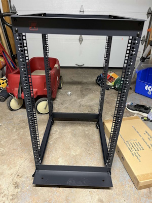
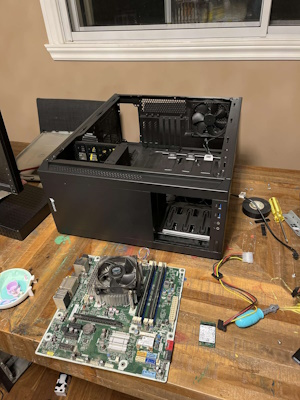
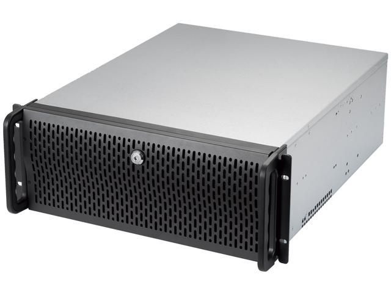

So I'd figure if anyone actually reads this part of my website I'd update people on my plans.

## TrueCharts

Hammering away now that the common migration is done and nearly everything is migrated, along with the new operators. The biggest change behind the scenes is the move to [Open Collective](https://opencollective.com/truecharts) so the finances from the team will be public and people can place bounties on bugs and/or order a Chart. I did my first one, [Seafile](https://truecharts.org/charts/stable/seafile/) if you want to check it out. I'll do some if they come up but it won't be my main source of income that's for sure haha. Otherwise just trying to clean up little bugs or documentation whenever I can.

## Homelab

Throwing that up since it's the Step 1 in the remodel of the Homelab. I'll be placing the R730, my backup NAS, which during the time of this docs site has been downgraded due to parents circumstances to a modified HP Envy from 2014 haha

Current Backup Box specs:
- i7-3770 4c/8t CPU
- Random HP board with 6 SATA ports (just enough) with USB3->SATA for TrueNAS OS SSD
- 4x8gb 1600 DDR3 RAM (miss my ECC ram)
- 4x4tb in Z1 for backup (all WD Red Plus) -> Tanks
- 2x512gb SATA Silicon-Power SSD's -> Apps mirror
- 1x256gb SATA SP SSD -> TrueNAS boot-drive
- 10gb Solarflace NIC -> Gotta have fast transfers sicne since my HBA doesn't work well

It's currently in a Corsair Carbine 70D or whatever case, here's a picture of the assembly

I'll take some before and after pictures, since it's going to a new home this weekend, a `Rosewill RSV-R4000U 4U Server Chassis` with rails.

## Home Security

I also picked up 2 PoE Reolink cameras and I'll be install those later, I may share some pictures of that and the process, since it involves me passing wires outside, which is very sketch. Also installing that into the sophits won't be easy.

Alright enough for now, hope someone enjoyed my update haha