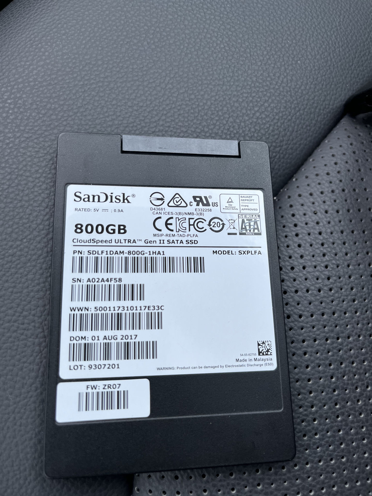
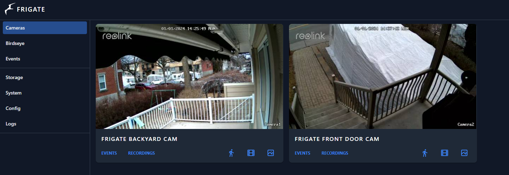
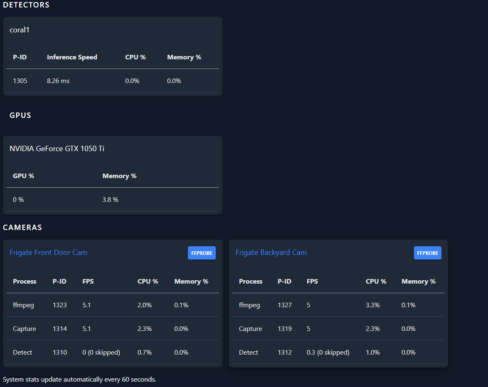
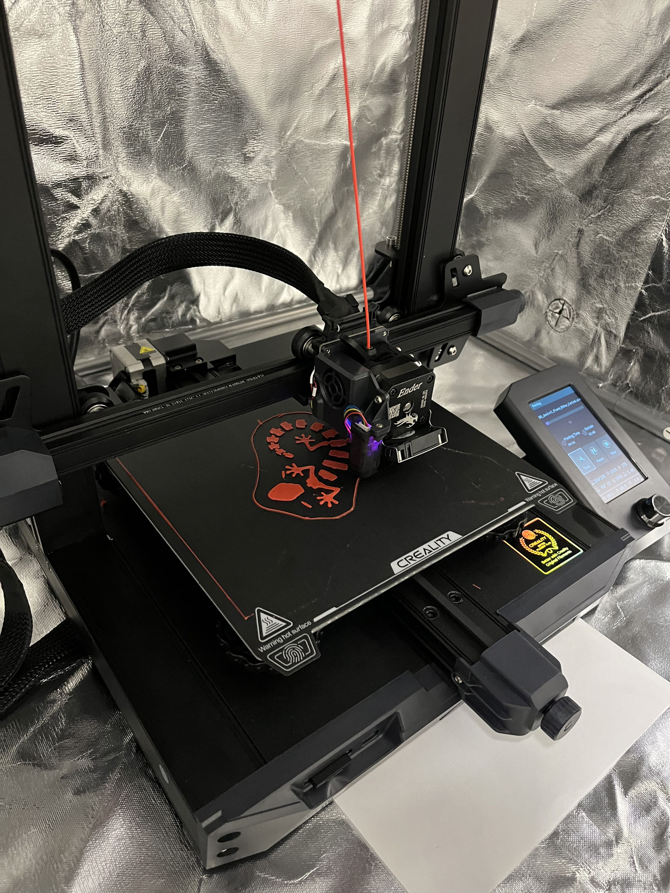

I don't take stats on how many people read this but this might be fun to read later on and remember

## TrueCharts

TrueCharts is humming along, they did some updates to the backend, we need to change more documents, and I've been receiving a stipend from the donations to help out buy more toys. They're working on tons of cool stuff behind the scenes, however I got to build another custom-order chart in `External-DNS`, which helped cover some of the costs of the new toys below. Always work I want to do for TC but time on weeknights/weekends is limited, especially with William.

## Homelab

Man what a difference 5 months makes

August 2023

January 2024

We got everything in place in there, here's the front and the back

From top to bottom here's the Hardware

- Old 19" Dell monitor from work (kept the extra 24" upstairs)
- Fizz Hitron Cable Modem (Currently on 400/50), one day I pray for Fiber
- OPNsense Box - Lenovo m720q
- Backup TrueNAS - Custom AMD 5900X
- Production TrueNAS - Dell R730
- UPS - Liebert 1500VA UPS

Back

Brocade ICX6450-48P Switch

Bottom

2x Cyberpower 600VA UPS (Amazon sent 2, why not)

Current Backup TrueNAS specs (one day this will be productions and I may run a cluster of 3 Kubernetes machines):
- AMD Ryzen 9 5900X (feels good to get an AMD CPU after a long while)
- Asus ROG Strix B550 motherboard (Facebook marketplace find)
- 4x32gb Crucial 3200mhz ECC UDIMMs (Imported from the US from Crucial.com)
- 4x4tb in Z1 for backup (all WD Red Plus) -> Tank
- 2x800gb SATA Sandisk SA-620 SSD's -> Apps mirror (MLC devices with low hours)
- 1x16gb Intel Optane nvme SSD -> TrueNAS boot-drive
- 10gb Solarflace NIC -> That hasn't change
- Random AMD Cezanne Video Card -> HDMI output

It's inside this monster space

I actually did 2 upgrades, one was to a R5 3600 and B450 board but I got a good deal on the R9 5900 and a chunk back in taxes so went full tilt with specs above. Also had some scary moments when I upgraded the cooling from the stock R5 3600 fan to a new cooler (Thermalright Assassin Spirit 120 V2 Plus)

Looks smooth now

Those updates, combined with the MLC drives I'm rocking again below, should make this thing last a while

In case people are wondering what the production machine looks like

**Dell Poweredge R730 13th Gen Server**
- 2x Intel Xeon E5-2667 V4 CPUs @ 3.2ghz with 25 MB cache
- 240 GB Ram (running at 2133mhz, and it came with 2x8gb, upgraded the rest in pairs of 16gb sticks)
- 4 x 10tb drives in a 2x2 mirrored setup (2 Seagate Ironwolf Pros and 2 WD Red Plus)
- 2 x 400gb Sandisk SA-620 MLC drives for Metadata
- 1 x 256gb drive for boot (inside DVD-Rom slot)
- 4 x 1tb Samsung 970 Evo nVME drives for apps / VMs inside a 16x PCI-E card
- 4gb nVidia Gefore 1050 GTX ti for transcoding
- Google Coral miniPCIE card inside adatper for ML/Frigate
- Upgraded Networking Daughterboard (2x Intel X520 and 2x Intel i350) so you get 10gb sfp+ + 1gb RJ-45 ports
- Added Riser 1 and Riser 3 upgrades

## Home Security

The Reolinks are installed and running, I don't feel like going outside so here's some fun pictures from Frigate

Main view

And everything working smooth

## 3D Printers

Bought a Creality Ender 3 S1, it's fun but I never have enough time, here's a fun print

