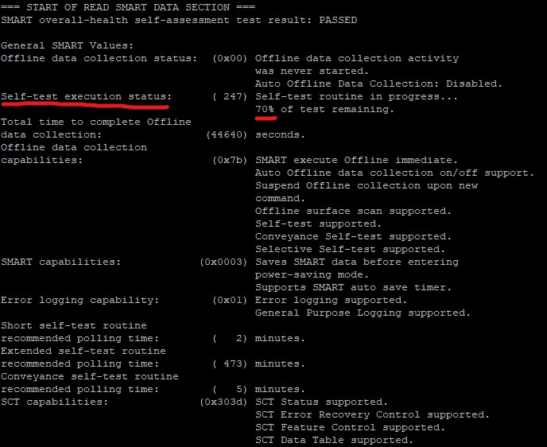
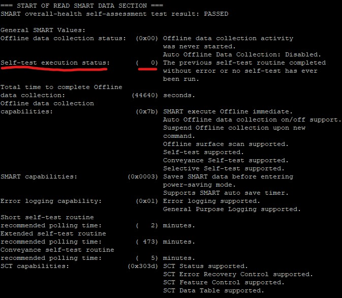
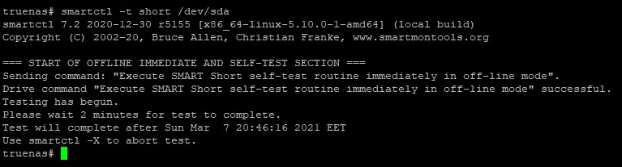
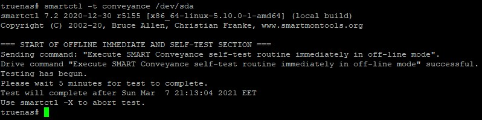
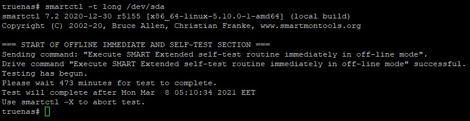
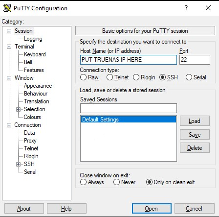
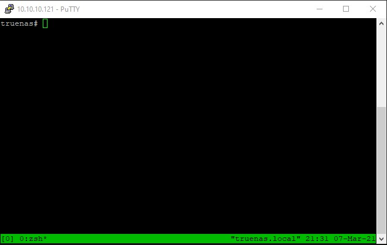
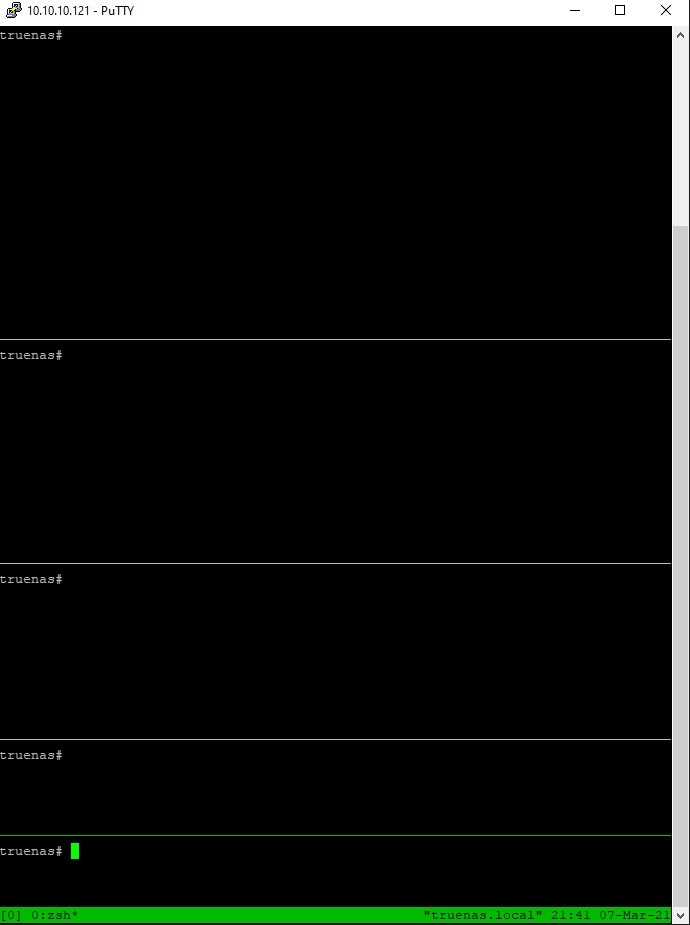
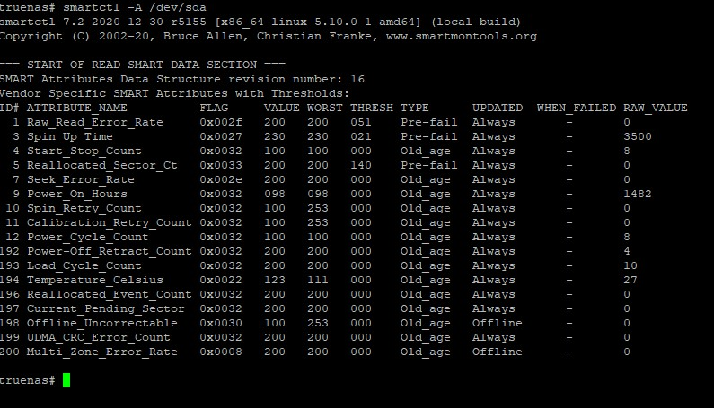

# HDD Stress Test

## First step, S.M.A.R.T. tests (Scan HDD for problems)

We will use `smartctl` for this step, to get the state of the HDD before we stress it.

You can view the progress of any of the following tests with this:
`smartctl -a /dev/sdX`

The progress (in percentage) of the test is in the line `Self-test execution status:`

|                                  Running Test                                   |                                         Finished Test                                          |
| :-----------------------------------------------------------------------------: | :--------------------------------------------------------------------------------------------: |
|  |  |

Zero (`0`) means our test is finished or no test is running.
You can always stop a test with `smartctl -X /dev/sdX`

> Replace X with your driver letter

### Short test

First test will be the `short`.

`smartctl -t short /dev/sdX`



Approximately 2 minutes on a 4TB HDD.

### Conveyance test

Second test will be the `conveyance`.

`smartctl -t conveyance /dev/sdX`



Approximately 5 minutes on a 4TB HDD.

### Long test

Last test will be the `long`.

`smartctl -t long /dev/sdX`



Approximately 500 minutes on a 4TB HDD.
This test can take a lot of time, depending on your HDD size.

## Second step, stressing the HDD

### Preparation

This step should be down with SSH, using `tmux`. This will help to keep test running even if the connection is lost.
Enable `SSH` service on `TrueNAS` (<kbd>System Settings</kbd> -> <kbd>Services</kbd> -> <kbd>SSH</kbd>)


Open your SSH client of your choice, I will use `Putty`.
SSH to TrueNAS, using it's IP address and login



Type `tmux` You can now see a green bar on the bottom of the terminal



### HDD Stress

:::danger

This step will **DELETE** any data on the HDD

:::

> Now lets stress the HDD

`badblocks -b 4096 -wvs /dev/sdX`

`-b` sets the block size
`-w` does a destructive stress, meaning that will **DELETE** all data on that disk
`-v` prints verbose info
`-s` prints progress

`badblocks` do `4` passes:

```shell
-First pass testing with pattern 0xaa (10101010)
-Then Reading and comparing
-Second pass testing with pattern 0x55 (01010101)
-Then Reading and comparing
-Third pass testing with pattern 0xff (11111111)
-Then Reading and comparing
-Fourth pass testing with pattern 0x00 (00000000)
-Then Reading and comparing
```

<!--  -->
Missing image of *badblocks running*, Sorry

To run the test to the other HDDs, press <kbd>Ctrl</kbd>+<kbd>B</kbd> then <kbd>"</kbd>, this will split the screen,
there you can run `badblocks` on the next HDD. You can split as many times as you want.



After starting badblocks for all your HDDs, you can leave the ssh open or close it. In order to reconnect later,
ssh back to TrueNAS, and do `tmux attach`

`badblocks` result example of good HDDs:

```shell
truenas# badblocks -b 4096 -wvs /dev/sda
Checking for bad blocks in read-write mode
From block 0 to 976754645
Testing with pattern 0xaa: done
Reading and comparing: done
Testing with pattern 0x55: done
Reading and comparing: done
Testing with pattern 0xff: done
Reading and comparing: done
Testing with pattern 0x00: done
Reading and comparing: done
Pass completed, 0 bad blocks found. (0/0/0 errors)
```

## Third step, Results

When `badblocks` stresses is over. We need to do another `long` test on each HDD.

`smartctl -t long /dev/sdX`

After `long` is done, is time for our results.
We get them with this:

`smartctl -A /dev/sdX` (Note the capital `A`)

The important fields are `Reallocated_Sector_Ct`, `Current_Pending_Sector`, and `Offline_Uncorrectable` lines.
All these should have `RAW_VALUE` of `0`, even if the `VALUE` field is listed as `200`.
Any result greater that `0` should be a cause for RMA.

`smartctl -A /dev/sdX` result of good HDDs:


