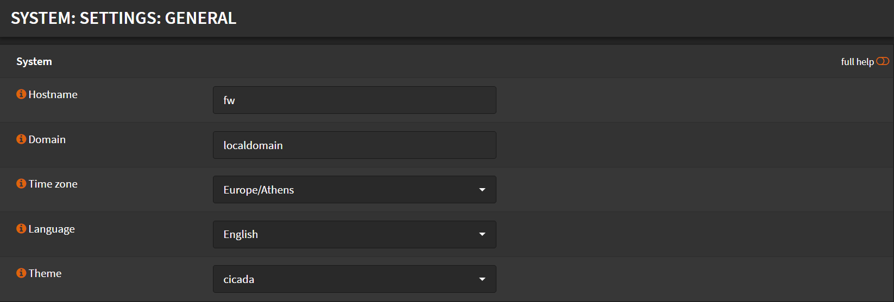
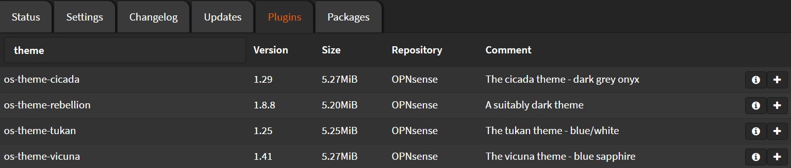

# General

## Settings

- Hostname: Set your preferred host name
- Domain: Set your preferred domain
- Time zone: Select your region
- Language: Select your preferred language
- Theme: Select a theme (if you have any installed)



Click <kbd>Save</kbd>

## Theme Installation

Navigate to `System` -> `Firmware` -> `Plugins`

Search for `theme` and click <kbd>➕</kbd> next to the theme you want to install



Wait until you see `**DONE**`

```shell
***GOT REQUEST TO INSTALL***
Currently running OPNsense 22.7.1 (amd64/OpenSSL) at Mon Aug 15 18:01:08 EEST 2022
Updating OPNsense repository catalogue...
OPNsense repository is up to date.
All repositories are up to date.
Checking integrity... done (0 conflicting)
The following 1 package(s) will be affected (of 0 checked):

New packages to be INSTALLED:
  os-theme-cicada: 1.29

Number of packages to be installed: 1

The process will require 5 MiB more space.
[1/1] Installing os-theme-cicada-1.29...
[1/1] Extracting os-theme-cicada-1.29: .......... done
Checking integrity... done (0 conflicting)
Nothing to do.
***DONE***
```
