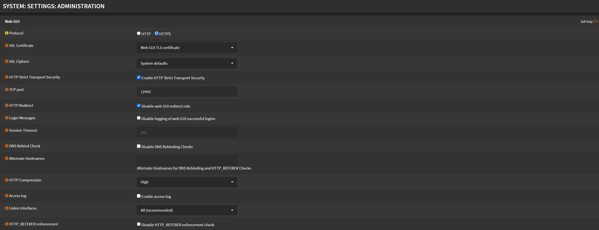
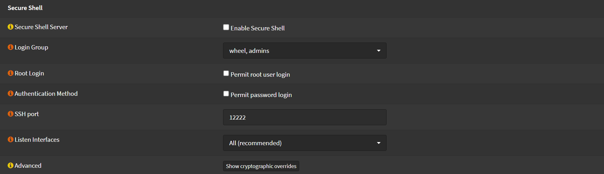

# Administration

Navigate to `System` > `Settings` > `Administration`

## Web UI

- Check `HTTP Strict Transport Security`
- Uncheck `Disable web GUI redirect rule` (Firewall will only serve HTTPS now)
- HTTP Compression: `High` (If you have a low power device, leave it off)
- TCP Port: Recommended to change it

## SSH

- Keep `Secure Shell` disabled, unless you are gonna use it.
- Uncheck `Permit root user login`, Recommended to use SSH Keys.
- SSH Port: Recommended to change it

Click <kbd>Save</kbd>
