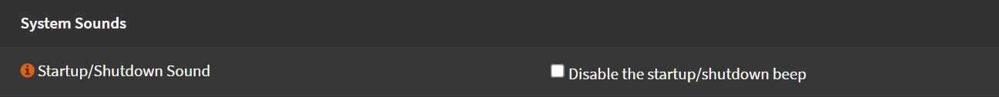

# Miscellaneous

Navigate to `System` -> `Settings` -> `Miscellaneous`

## Thermal Sensors

### Intel Chip

Hardware: `Intel Core* CPU on-die thermal sensor (coretemp)`

### AMD Chip

Hardware: `AMD K8, K10 and K11 CPU on-die thermal sensor (amdtemp)`

## Periodic Backups

- Periodic RRD Backup: `1 Hour`
- Periodic DHCP Leases Backup: `1 Hour`
- Periodic NetFlow Backup: `1 Hour`
- Periodic Captive Portal Backup: `Power off`

I use the above values, you can choose whatever you prefer.
I don't use Captive Portal, so I have this set to `Power Off`

## Power Savings

You can enable power savings feature and configure how it behaves when it's plugged in or on batteries.

- Check `Use PowerD`
- On AC Power Mode: `Select the profile you want`
- On Battery Power Mode: `Select the profile you want`
- On Normal Power Mode: `Select the profile you want`

Usually `hiadaptive` is a good choice

## System Sounds

If you **don't** want system to make starup/shutdown sounds (`beep`)

Check `Disable the startup/shutdown beep`

Click <kbd>Save</kbd>
