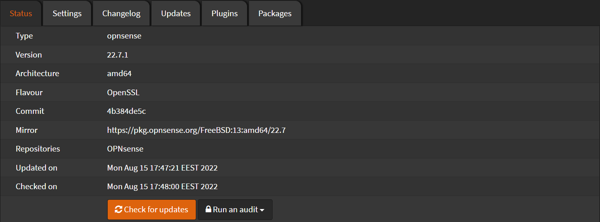

# Update

In order to check for updates on your system

Navigate to `System` > `Firmware` > `Status`

Click `Check for updates`

If a newer version exists, it will show a pop up and prompt you to upgrade.
