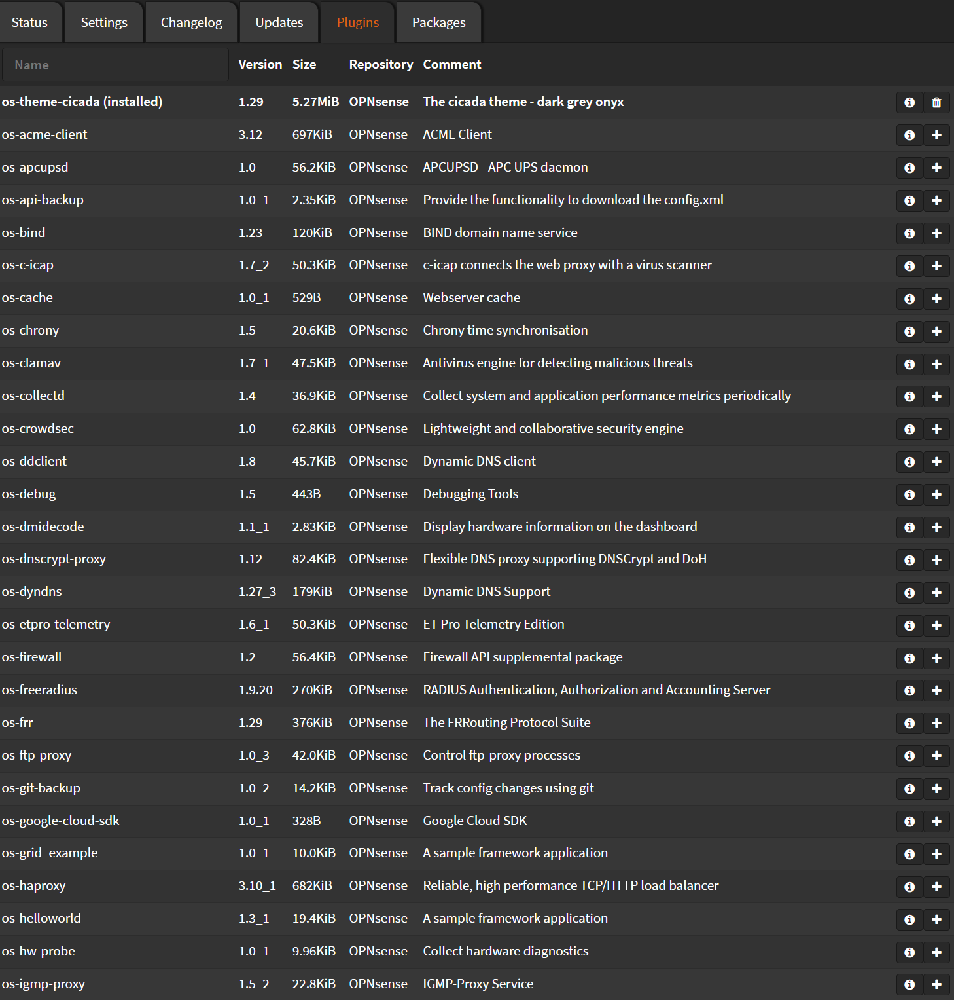

# Plugins

Navigate to `System` > `Firmware` > `Plugins`

This is a list of the available plugins.

On the top usually is your installed plugins.

From here you can install packages like themes, wireguard, haproxy, nginx, crowdsec etc.
