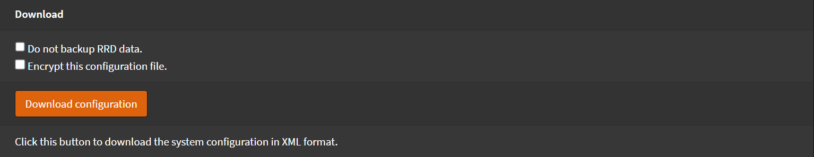
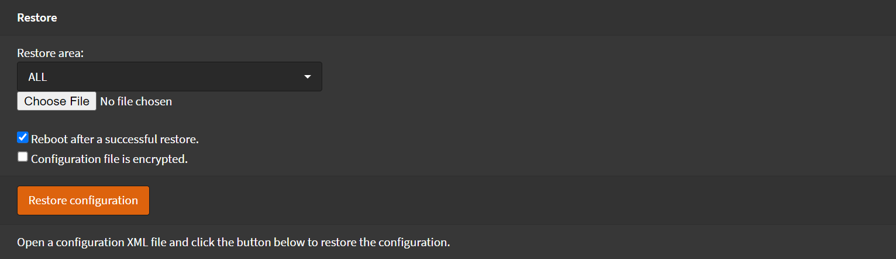

# Backup / Restore

Navigate to `System` > `Configuration` > `Backups`

Here you can `backup` or `restore` your configuration.

## Backup

To download a copy of your configuration

- Uncheck `Do not backup RRD data`
- Click <kbd>Download configuration</kbd>

## Restore

- Click `Choose File`
- Select your backup file
- Check `Reboot after a successful restore`
- Click <kbd>Restore Configuration</kbd>

