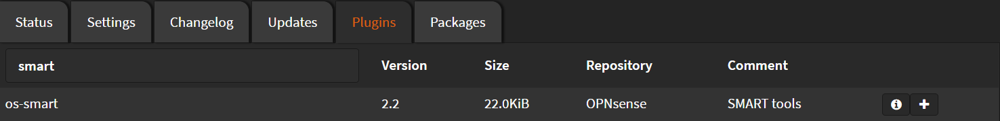

# Installation

Navigate to `System` > `Firmware` > `Plugins`

Search for `smart` and click <kbd>➕</kbd>



Wait until you see `**DONE**`

```shell
***GOT REQUEST TO INSTALL***
Currently running OPNsense 22.7.1 (amd64/OpenSSL) at Mon Aug 15 23:50:34 EEST 2022
Updating OPNsense repository catalogue...
OPNsense repository is up to date.
All repositories are up to date.
The following 2 package(s) will be affected (of 0 checked):

New packages to be INSTALLED:
  os-smart: 2.2
  smartmontools: 7.3

Number of packages to be installed: 2

The process will require 2 MiB more space.
453 KiB to be downloaded.
[1/2] Fetching os-smart-2.2.pkg: . done
[2/2] Fetching smartmontools-7.3.pkg: .......... done
Checking integrity... done (0 conflicting)
[1/2] Installing smartmontools-7.3...
[1/2] Extracting smartmontools-7.3: .......... done
[2/2] Installing os-smart-2.2...
[2/2] Extracting os-smart-2.2: .......... done
Stopping configd...done
Starting configd.
Reloading plugin configuration
Configuring system logging...done.
=====
Message from smartmontools-7.3:

--
smartmontools has been installed

To check the status of drives, use the following:

  /usr/local/sbin/smartctl -a /dev/ad0  for first ATA/SATA drive
  /usr/local/sbin/smartctl -a /dev/da0  for first SCSI drive
  /usr/local/sbin/smartctl -a /dev/ada0 for first SATA drive

To include drive health information in your daily status reports,
add a line like the following to /etc/periodic.conf:
 aily_status_smart_devices="/dev/ad0 /dev/da0"
substituting the appropriate device names for your SMART-capable disks.

To enable drive monitoring, you can use /usr/local/sbin/smartd.
A sample configuration file has been installed as
/usr/local/etc/smartd.conf.sample
Copy this file to /usr/local/etc/smartd.conf and edit appropriately

To have smartd start at boot echo 'smartd_enable="YES"' >> /etc/rc.conf
Checking integrity... done (0 conflicting)
Nothing to do.
***DONE***
```
