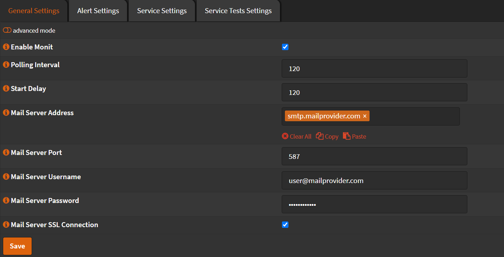
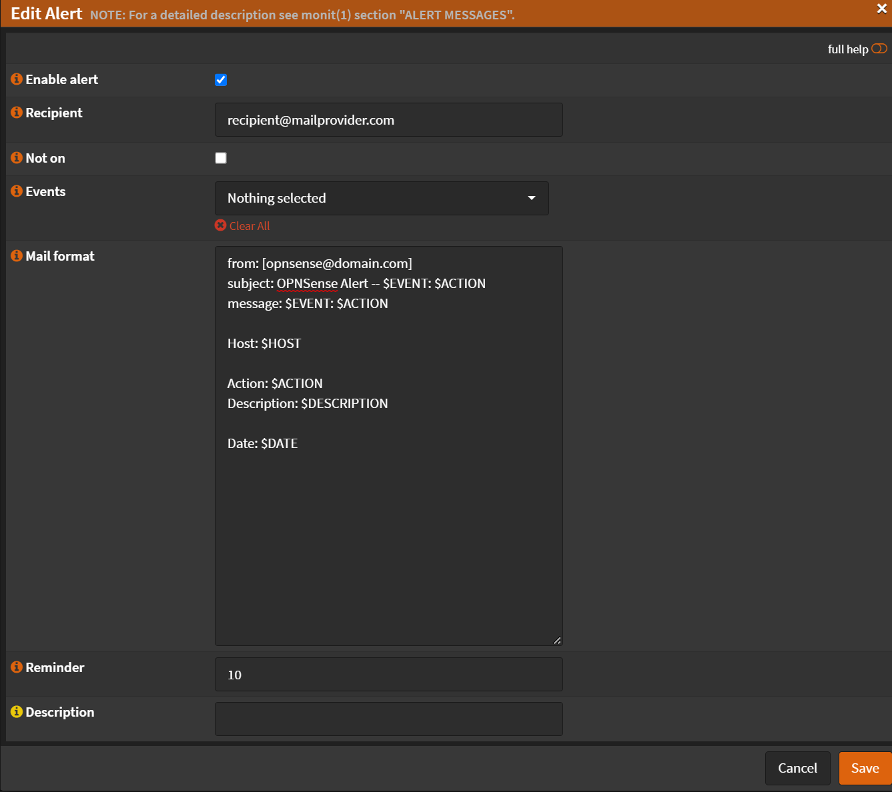

# Configuration

Navigate to `Services` -> `Monit` -> `Settings` -> `General Settings`

- Check `Enable Monit`
- Mail Server Address: `your.smtp.server.com`
- Mail Server Port: `587` (Check your SMTP for the actual port)
- Mail Server Username: `your-smtp-username`
- Mail Server Password: `your-smtp-password`
- Check `Mail Server SSL Connection` (depends on your SMTP)
- Click <kbd>Save</kbd>



Navigate to `Services` -> `Monit` -> `Settings` -> `Alert Settings`

- Click <kbd>➕</kbd>
- Check `Enable alert`
- Recipient: `your.mail@address.com`
- Events: `Nothing Selected` (This will send notifications for all events)
- Mail format:

  ```text
  from: [opnsense@yourdomain.com]
  subject: OPNSense Alert -- $EVENT: $ACTION
  message: $EVENT: $ACTION

  Host: $HOST

  Action: $ACTION
  Description: $DESCRIPTION

  Date: $DATE
  ```

- Click <kbd>Save</kbd>



- Click <kbd>Apply</kbd>
