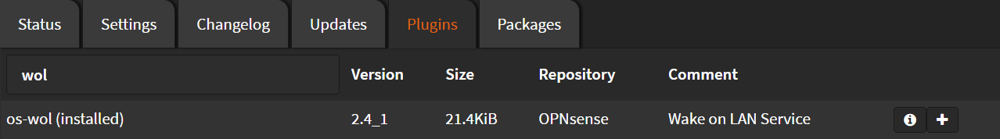

# Installation

Navigate to `System` > `Firmware` > `Plugins`

Search for `wol` and click <kbd>➕</kbd>



Wait until you see `**DONE**`

```shell
***GOT REQUEST TO INSTALL***
Currently running OPNsense 22.7.2 (amd64/OpenSSL) at Mon Aug 22 21:57:51 EEST 2022
Updating OPNsense repository catalogue...
OPNsense repository is up to date.
All repositories are up to date.
The following 2 package(s) will be affected (of 0 checked):

New packages to be INSTALLED:
  os-wol: 2.4_1
  wol: 0.7.1_4

Number of packages to be installed: 2

32 KiB to be downloaded.
[1/2] Fetching os-wol-2.4_1.pkg: . done
[2/2] Fetching wol-0.7.1_4.pkg: .... done
Checking integrity... done (0 conflicting)
[1/2] Installing wol-0.7.1_4...
[1/2] Extracting wol-0.7.1_4: ........ done
[2/2] Installing os-wol-2.4_1...
[2/2] Extracting os-wol-2.4_1: .......... done
Stopping configd...done
Starting configd.
Migrated OPNsense\Wol\Wol from 0.0.0 to 1.0.0
Reloading plugin configuration
Configuring system logging...done.
Checking integrity... done (0 conflicting)
Nothing to do.
***DONE***
```
