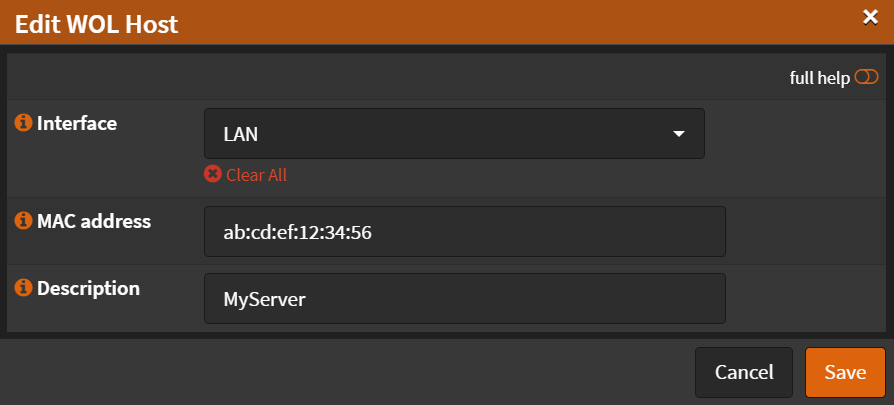

# Configuration

Navigate to `Services` -> `Wake On LAN`

- Click <kbd>➕</kbd>
- Interface: `LAN` (Choose the interface where target is connected)
- MAC Address: `mac:address:of:target:machine:to-wake`
- Description:`MyServer`

- Click <kbd>Save</kbd>

To wake up a machine, click <kbd>🕒</kbd>

:::note

Target machine must support Wake on LAN, and it must be enabled in BIOS

:::
