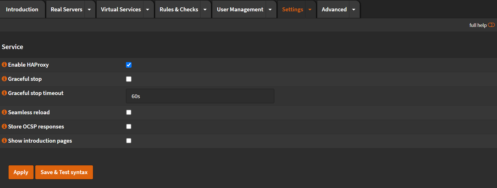
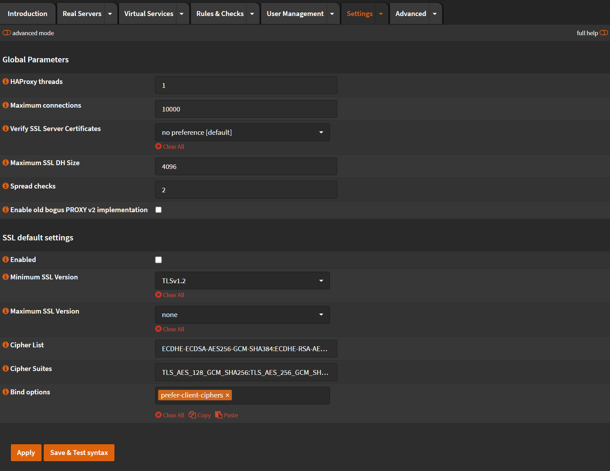
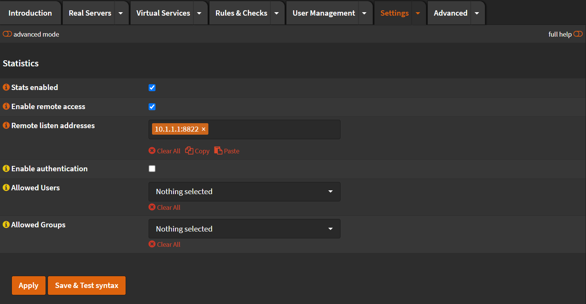
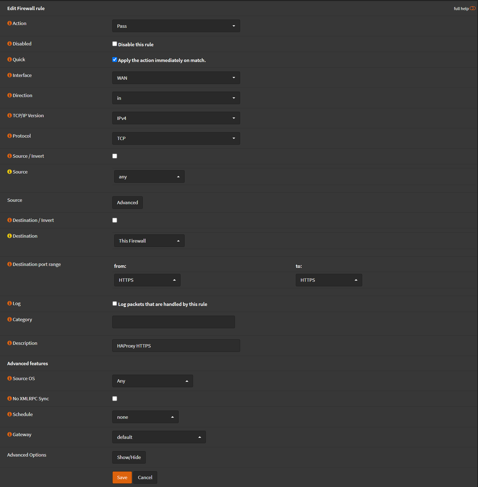
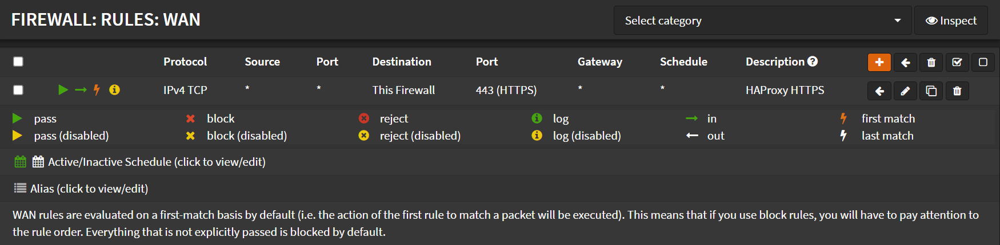

# Configuration

## Enable HAProxy

Navigate to `Services` -> `HAProxy` -> `Settings`

- Click on <kbd>🔽</kbd> next to `Settings` tab
- Click `Service`
- Check `Enable HAProxy`
- Uncheck `Show introduction pages`

- Click <kbd>Apply</kbd>
- Verify on the top right corner the <kbd>▶️</kbd> icon is `Green`

## Global Parameters

Navigate to `Services` -> `HAProxy` -> `Settings`

- Click on <kbd>🔽</kbd> next to `Settings` tab
- Click `Global Parameters`
- Maximum connections: `10000`
- Maximum SSL DH Size: `4096`

- Click <kbd>Apply</kbd>

## Enable Statistics

Navigate to `Services` -> `HAProxy` -> `Settings`

- Click on <kbd>🔽</kbd> next to `Settings` tab
- Click `Statistics`
- Check `Stats enabled`
- Check `Enable remote access`
- Remote listen address: `YOUR.FIREWALL.LOCAL.IP:8822`

- Click <kbd>Apply</kbd>

You can visit the statistics page on `http://YOUR.FIREWALL.LOCAL.IP:8822/haproxy?stats`

## Firewall

### Rules

We need to open `HTTPS/443` port

Navigate to `Firewall` -> `Rules` -> `WAN`

- Click <kbd>➕</kbd>
- Interface: `WAN`
- Direction: `in`
- TCP/IP Version: `IPv4`
- Protocol: `TCP`
- Source: `any`
- Destination: `This Firewall`
- Destination port range:
  - From: `HTTPS`
  - To: `HTTPS`
- Description: `HAProxy HTTPS`

- Click <kbd>Save</kbd>
- Click <kbd>Apply Changes</kbd>

### Port Forward

Navigate to `Firewall` -> `NAT` -> `Port Forward`

- Click <kbd>➕</kbd>
- Interface: `WAN`
- TCP/IP Version: `IPv4`
- Protocol: `TCP`
- Destination: `WAN address`
- Destination port rage:
  - From: `HTTPS`
  - To: `HTTPS`
- Redirect target IP: `127.0.0.1`
- Redirect target port: `HTTPS`
- Description: `Forward HTTPS to HAProxy`

- Click <kbd>Save</kbd>
- Click <kbd>Apply Changes</kbd>
