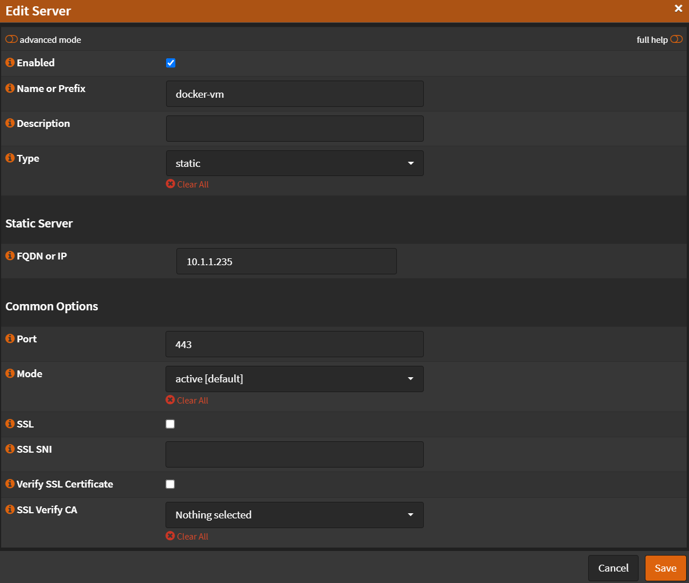
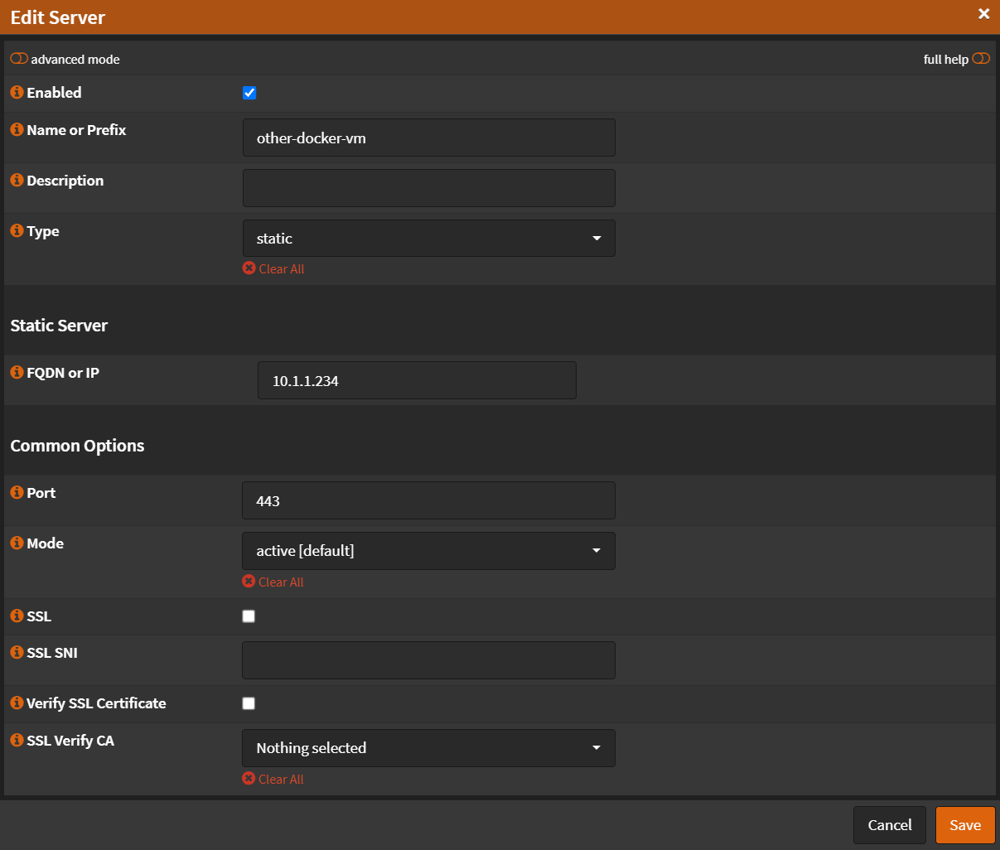

# Real Servers

Navigate to `Services` -> `HAProxy` -> `Settings`

- Click <kbd>🔽</kbd> next to `Real Servers`

## Server 1

- Click <kbd>➕</kbd>
- Name or Prefix: `docker-vm`
- Type: `static`
- Port `443`
- Uncheck `SSL`
- Uncheck `Verify SSL Certificate`

- Click <kbd>Save</kbd>
- Click <kbd>Apply</kbd>

## Server 2

- Click <kbd>➕</kbd>
- Name or Prefix: `other-docker-vm`
- Type: `static`
- Port `443`
- Uncheck `SSL`
- Uncheck `Verify SSL Certificate`

- Click <kbd>Save</kbd>
- Click <kbd>Apply</kbd>
