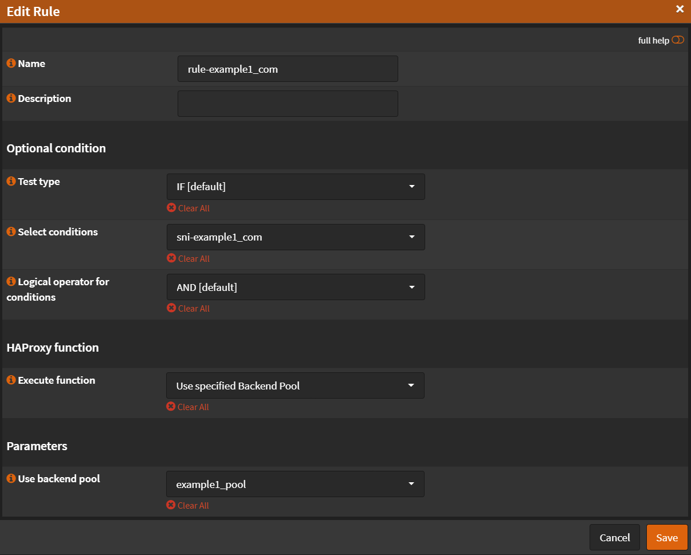

# Rules & Checks

Navigate to `Services` -> `HAProxy` -> `Settings`

- Click <kbd>🔽</kbd> next to `Rules & Checks`

## Health Monitors

- Click `Health Monitors`

### SSL Check

- Click <kbd>➕</kbd>
- Name: `SSL Check`
- Check type: `SSL`
- SSL preferences: `Use server settings`
- Check interval: `2s`

- Click <kbd>Save</kbd>
- Click <kbd>Apply</kbd>

## Conditions

Navigate to `Services` -> `HAProxy` -> `Settings`

- Click <kbd>🔽</kbd> next to `Rules & Checks`
- Click `Conditions`

### Condition Contains SSL Hello Message

- Click <kbd>➕</kbd>
- Name: `Contains SSL Hello Message`
- Condition Type: `SSL Hello Type`
- SSL Hello Type: `1-client-hello`

- Click <kbd>Save</kbd>
- Click <kbd>Apply</kbd>

### Condition SNI 1

- Click <kbd>➕</kbd>
- Name: `sni-example1_com`
- Description: `SNI Match all example1.com domain`
- Condition type: `SNI TLS extension contains (TCP request content inspection)`
- SNI Contains: `example1.com`

- Click <kbd>Save</kbd>
- Click <kbd>Apply</kbd>

### Condition SNI 2

- Click <kbd>➕</kbd>
- Name: `sni-example1_com`
- Description: `SNI Match all example1.com domain`
- Condition type: `SNI TLS extension contains (TCP request content inspection)`
- SNI Contains: `example2.com`

- Click <kbd>Save</kbd>
- Click <kbd>Apply</kbd>

## Rules

Navigate to `Services` -> `HAProxy` -> `Settings`

- Click <kbd>🔽</kbd> next to `Rules & Checks`
- Click `Rules`

### Rule TCP Inspect Delay

- Click <kbd>➕</kbd>
- Name: `TCP Inspect Delay`
- Execute function: `tcp-request inspect-delay`
- TCP inspection delay: `5s`

- Click <kbd>Save</kbd>
- Click <kbd>Apply</kbd>

### Rule Accept Content if Contains SSL Hello

- Click <kbd>➕</kbd>
- Name: `Accept Content if Contains SSL Hello`
- [Select conditions](2-rules-checks.md#condition-contains-ssl-hello-message): `Contains SSL Hello Message`
- Execute function: `tcp-request content accept`

- Click <kbd>Save</kbd>
- Click <kbd>Apply</kbd>

### Rule Backend 1

- Click <kbd>➕</kbd>
- Name: `rule-example1_com`
- [Select conditions](2-rules-checks.md#condition-sni-1): `sni-example1_com`
- Execute function: `Use specified Backend Pool`
- Use backend pool: `example1_pool`

- Click <kbd>Save</kbd>
- Click <kbd>Apply</kbd>

### Rule Backend 2

- Click <kbd>➕</kbd>
- Name: `rule-example1_com`
- [Select conditions](2-rules-checks.md#condition-sni-2): `sni-example2_com`
- Execute function: `Use specified Backend Pool`
- Use backend pool: `example2_pool`

- Click <kbd>Save</kbd>
- Click <kbd>Apply</kbd>
