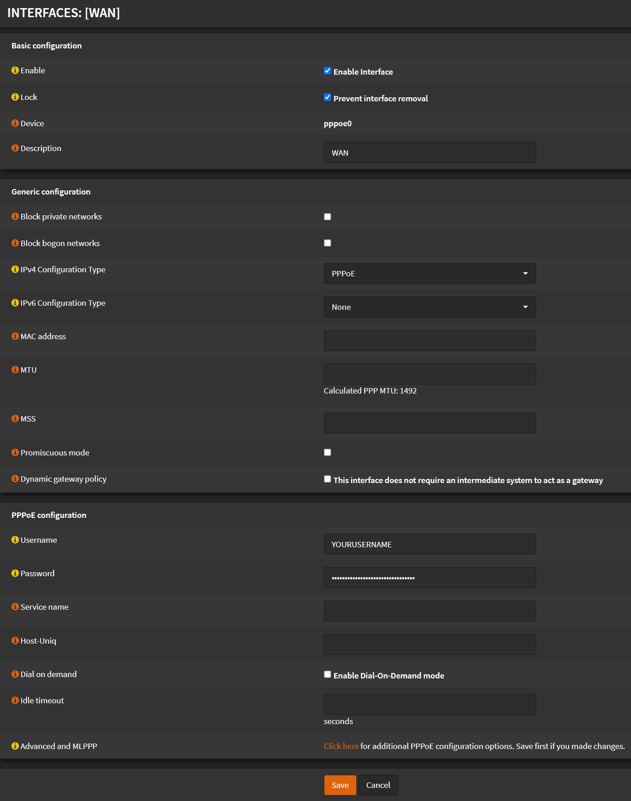
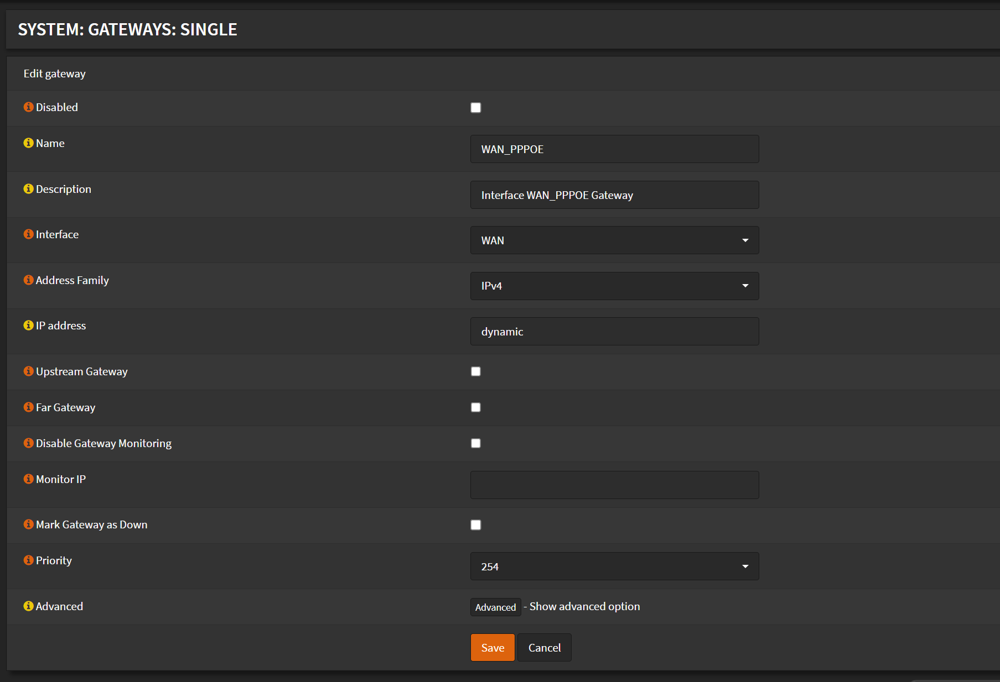

# Configuration

## WAN Interface

Navigate to `Interfaces` -> `[WAN]`

- Check `Enable Interface`
- Check `Prevent interface removal`
- Description: `WAN`
- Check `Block private networks`
- Check `Block bogon networks`
- IPv4 Configuration type: `PPPoE`
- IPv6 Configuration type: `None`
- Username: `YOURUSERNAME`
- Password: `YOURPASSWORD`

  

- Click <kbd>Save</kbd>
- Click <kbd>Apply Changes</kbd>

## Gateway

Navigate to `System` -> `Gateways` -> `Single`

- Click <kbd>✏️</kbd> on the `WAN_PPPOE (IPv4)` Gateway
- Uncheck `Disable Gateway Monitoring`

- Click <kbd>Save</kbd>
- Click <kbd>Apply Changes</kbd>
