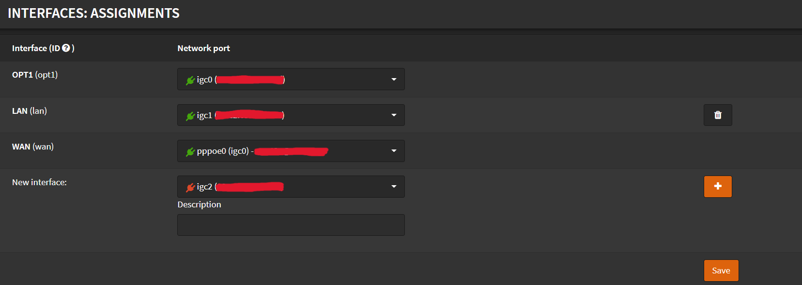
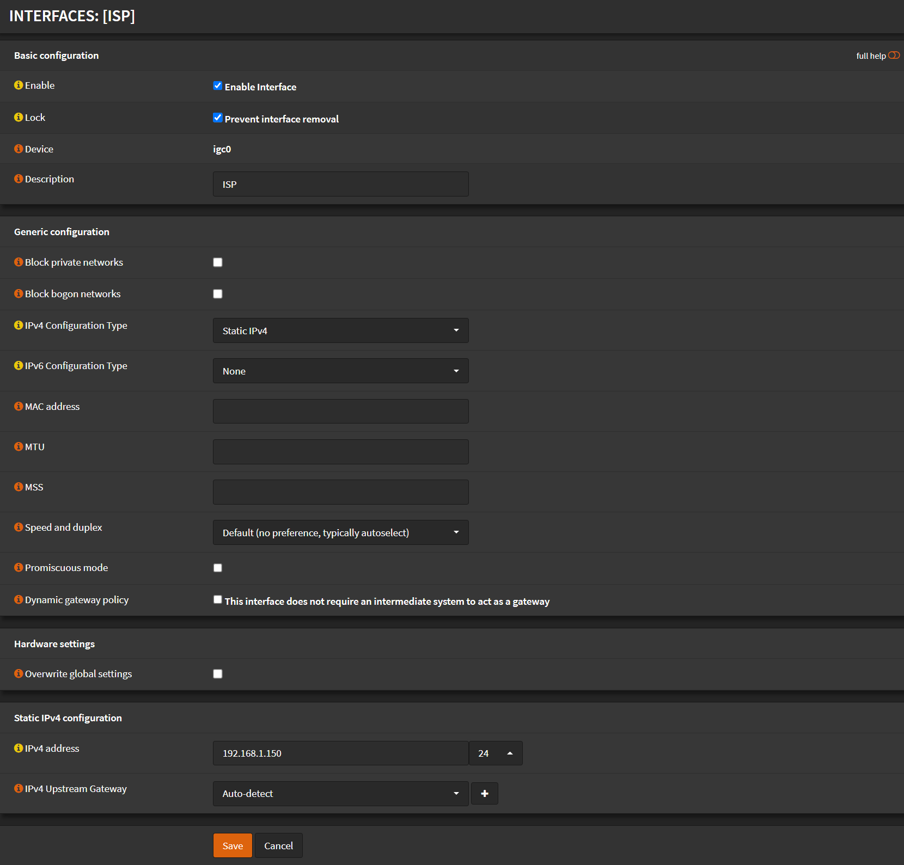
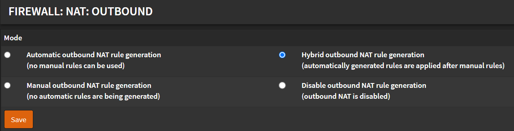
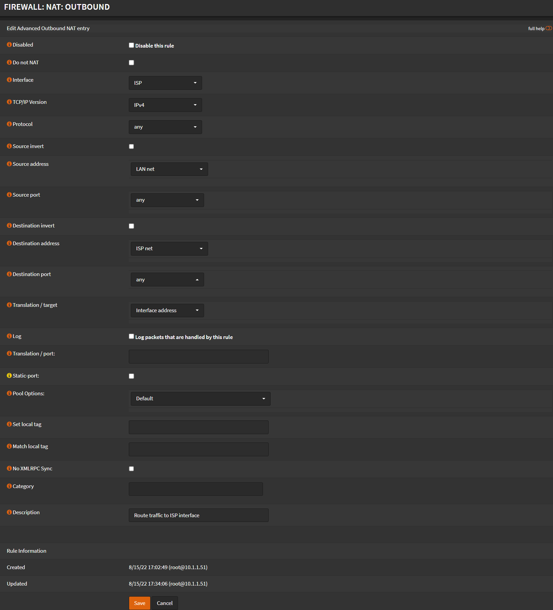

# Modem Access

As you have noticed, after setting your `WAN` interface to `PPPoE`, you don't have access to your modem/router webUI.

We have to add an interface and enable outbound NAT for that interface.
Let's fix that.

Navigate to `Interfaces` -> `Assignments`

## Interface

If your `WAN` interface has selected `Network port`: `pppoe0(igc0)`.

- Select next to `New interface` the `igc0`
- Click <kbd>➕</kbd>
- Click <kbd>💾Save</kbd>
- Click on the newly created interface

- Check `Enable Interface`
- Check `Prevent interface removal`
- Description: Give it a meaningful name (eg. `ISP`)
- Uncheck `Block private networks`
- Uncheck `Block bogon networks`
- IPv4 Configuration Type: `Static IPv4`
- IPv4 Address: Use an IP from the modem/router of your ISP (eg. `192.168.1.150` / `24`)
- Click <kbd>Save</kbd>
- Click <kbd>Apply Changes</kbd>

## NAT

Navigate to `Firewall` -> `NAT` -> `Outbound`

- Select `Hybrid outbound NAT rule generation`
- Click <kbd>Save</kbd>
- Click <kbd>Apply Changes</kbd>

- Click <kbd>➕</kbd>
- TCP/IP Version: `IPv4`
- Protocol: `any`
- Interface: `ISP` (or the name you gave before)
- Source address: `LAN net`
- Source port: `any`
- Destination address: `ISP net`
- Destination port: `any`
- Translation Address: `Interface Address`
- Click <kbd>Save</kbd>
- Click <kbd>Apply Changes</kbd>

You should now have access to your modem/router webUI!
