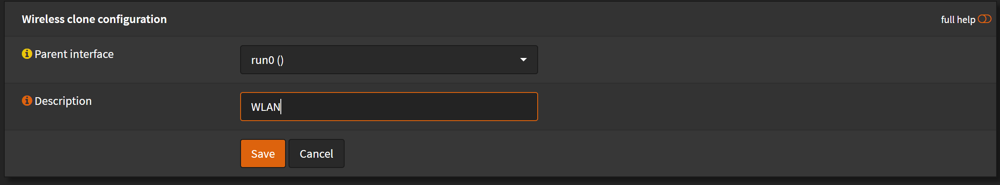
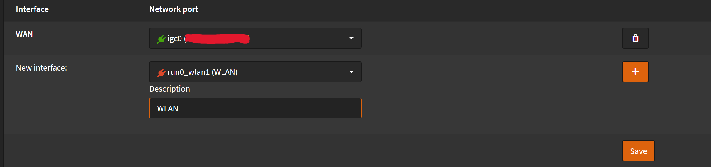
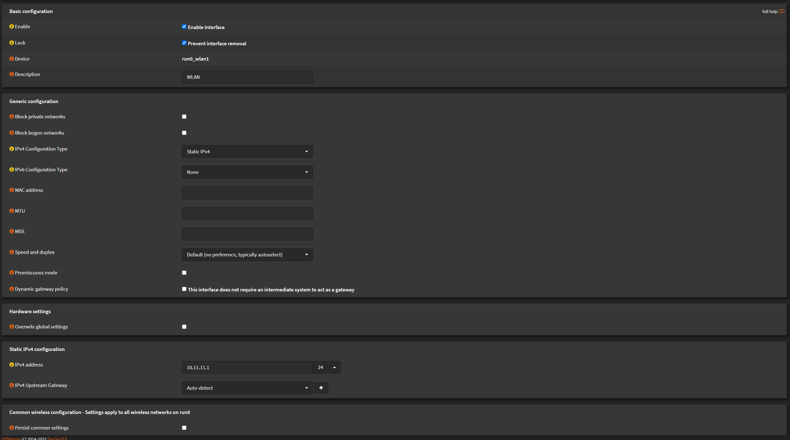
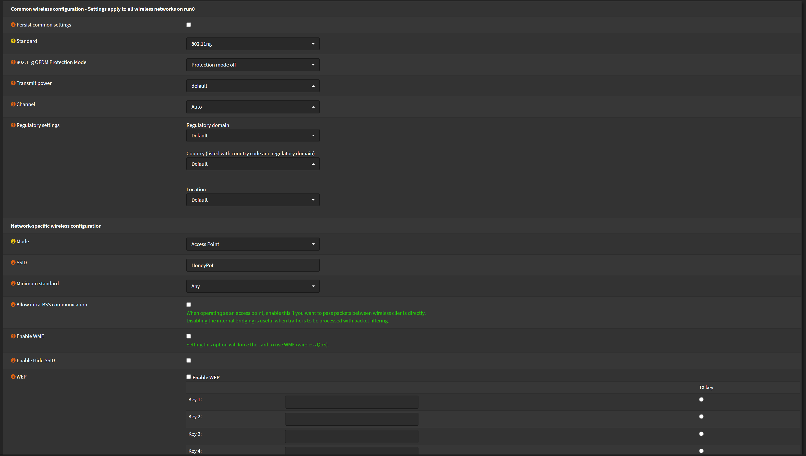
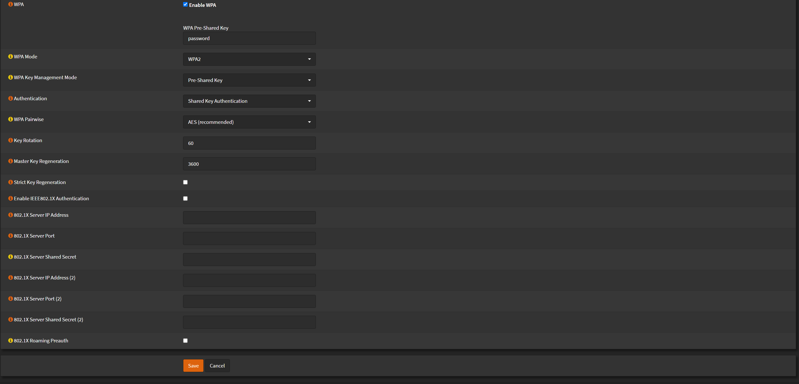
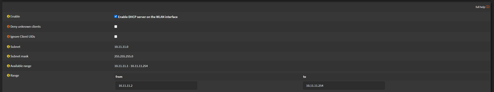
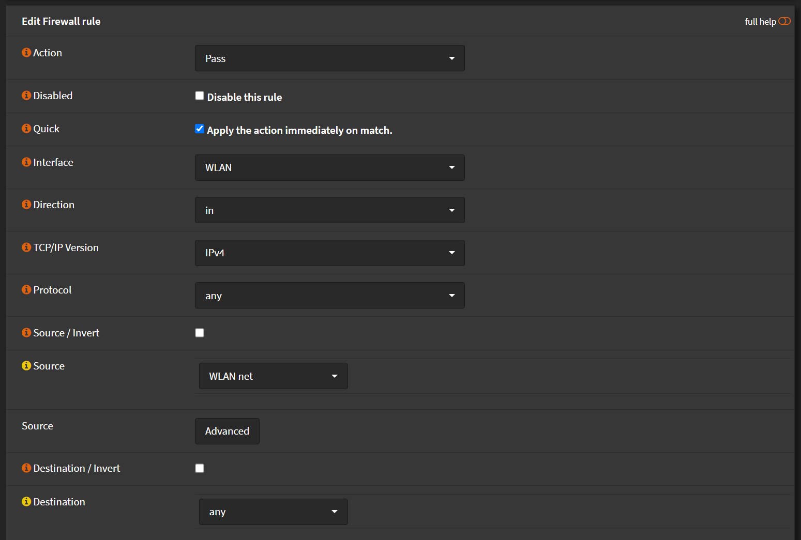

# Configuration

You can setup WiFi on OPNsense. Generally is not recommended, but sometimes might be useful.

Navigate to `Interfaces` > `Wireless` > `Devices`

- Click <kbd>+</kbd>
- `Parent interface`: `run0 ()`
- `Description`: `WLAN`

Click <kbd>Save</kbd> when you done

Navigate to `Interfaces` > `Assignments`

- `New interface`: `run0_wlan1 (WLAN)`
- Click <kbd>+</kbd>
- `Description`: `WLAN`

Click <kbd>Save</kbd> when you done

Navigate to `Interfaces` > `Assignments` > `[WLAN]`

- Check `Enable interface`
- Check `Prevent interface removal`
- `IPv4 Configuration Type`: `Static IPv4`
- `IPv4 address`: `10.11.11.1`/`24`

- `Standard`: `802.11ng` or anything greater if available
- `Mode`: `Access Point`
- `SSID`: `<YourSSID>`

- Check `Enable WPA`
- `WPA Pre-Shared Key`: `<YourPassword>`
- `WPA Mode`: `WPA2`
- `Authentication`: `Shared Key Authentication`
- `WPA Pairwise`: `AES (recommended)`

Click <kbd>Save</kbd>
Then Click <kbd>Apply changes</kbd>

Navigate to `Services` > `DHCPv4` > `[WLAN]`

- Check `Enable DHCP server on the WLAN interface`
- `Range`:
  - `from`: 10.11.11.2
  - `to`: 10.11.11.254

Click <kbd>Save</kbd> when you done

Navigate to `Firewall` > `Rules` > `WLAN`

- Click <kbd>+</kbd>
- `Action`: `Pass`
- `Interface`: `WLAN`
- `Direction`: `in`
- `TCP/IP Version`: `IPv4`
- `Source`: `WLAN net`

Click <kbd>Save</kbd>
Then Click <kbd>Apply changes</kbd>

You should now be able to connect to `YourSSID` with `YourPassword` and have access to internet.
