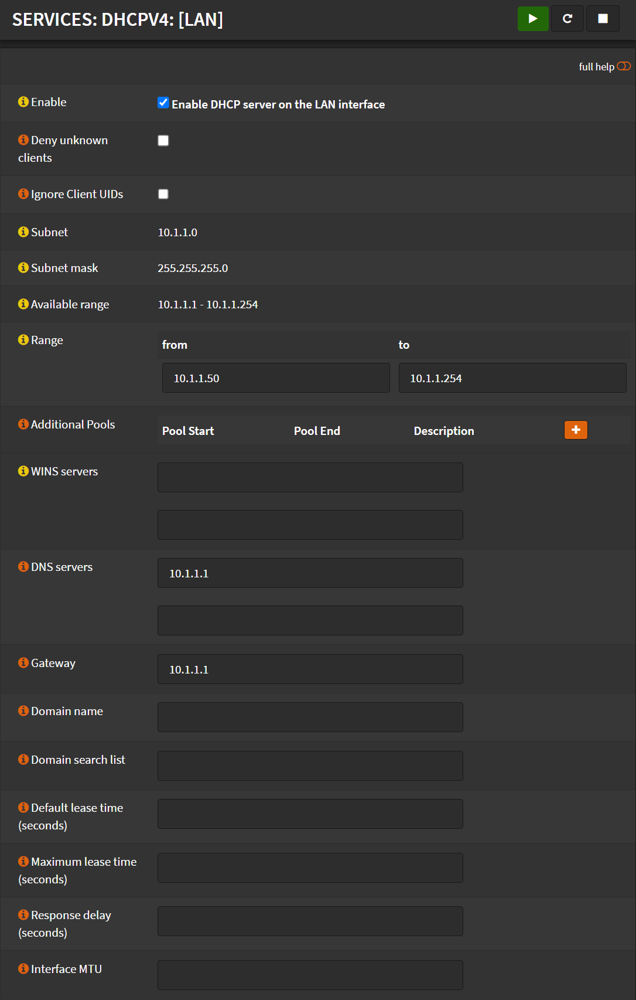
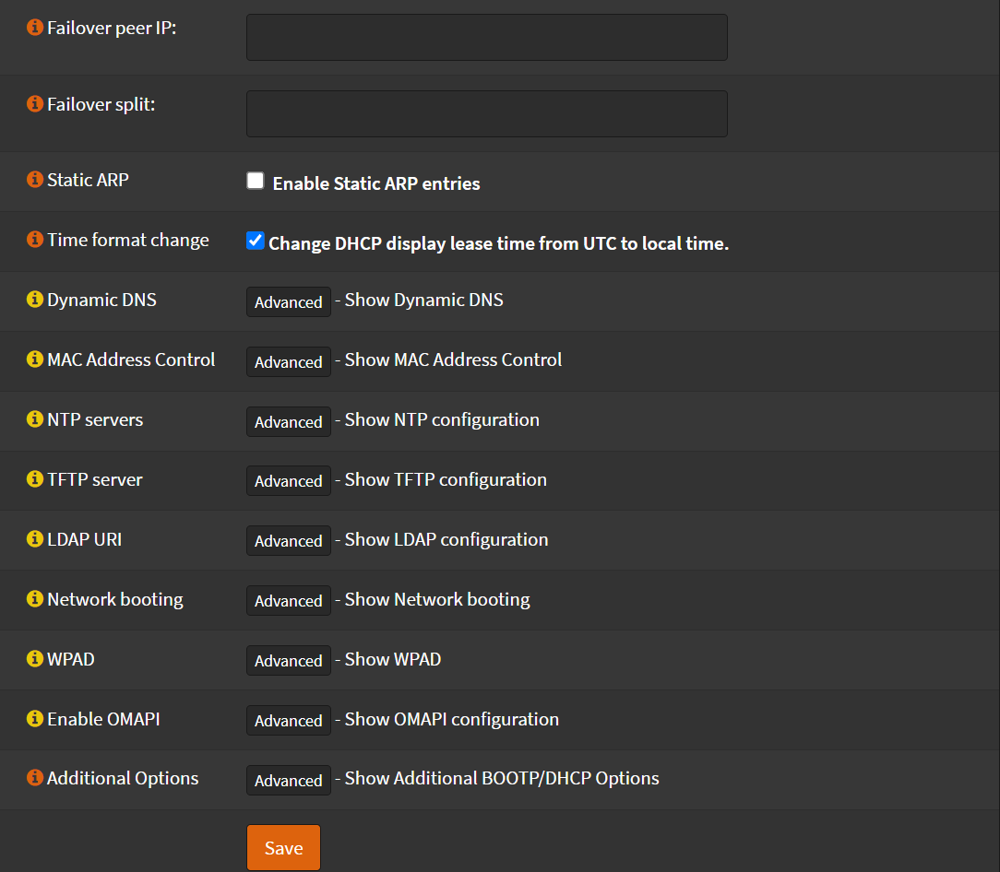

# Configuration

Navigate to `Services` -> `DHCPv4` -> `[LAN]*`

*Select the interface you want to configure the DHCP server for

I like to keep some IP's reserved for static mappings.
So for example for a network `10.1.1.1/24`, I set my DHCP range as bellow.

- Check `Enable`
- Range:
  - From: `10.1.1.50`
  - To: `10.1.1.230`
- DNS servers: `10.1.1.1`
- Gateway: `10.1.1.1`
- Check `Time format change`
- Check `Statistics graphs`
- Click <kbd>Save</kbd>

