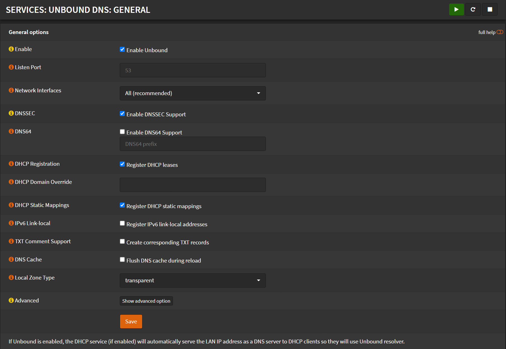

# Configuration

## Settings

Navigate to `Settings` -> `General`

Remove and DNS server (if any)

- Uncheck `Allow DNS server list to be overridden by DHCP/PPP on WAN`
- Uncheck `Do not use the local DNS service as a nameserver for this system`

## General

Navigate to `Services` -> `Unbound DNS` -> `General`

- Check `Enable Unbound`
- Listen Port: `53`
- Network Interfaces: `All (recommended)`
- Check `DNSSEC`
- Uncheck `DNS64`
- Check `Register DHCP leases`
- Check `Register DHCP static mappings`
- Uncheck `Register IPv6 link-local addresses`
- Local Zone Type: `transparent`
- Click <kbd>Save</kbd>
- Click <kbd>Apply Changes</kbd>

## Advanced

Navigate to `Services` -> `Unbound DNS` -> `Advanced`

- Check `Prefetch Support`
- Check `Prefetch DNS Key Support`
- Check `Harden DNSSEC data`
- Check `Serve expired responses`
- Message Cache Size: `50MB`
- Number of hosts to cache: `20000`
- Click <kbd>Save</kbd>

## DNS over TLS

Navigate to `Services` -> `Unbound DNS` -> `DNS over TLS`

- Uncheck `Use System Nameservers`
- Click <kbd>➕</kbd>
- Server IP: `1.1.1.1`
- Server Port: `853`
- Verify CN: `cloudflare-dns.com`
- Click <kbd>➕</kbd>
- Server IP: `1.0.0.1`
- Server Port: `853`
- Verify CN: `cloudflare-dns.com`
- Click <kbd>Apply</kbd>

