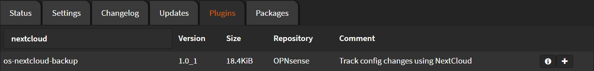

# Installation

Navigate to `System` > `Firmware` > `Plugins`

Search for `nextcloud` and click <kbd>➕</kbd>



Wait until you see `**DONE**`

```shell
***GOT REQUEST TO INSTALL***
Currently running OPNsense 22.7.1 (amd64/OpenSSL) at Mon Aug 15 21:46:44 EEST 2022
Updating OPNsense repository catalogue...
OPNsense repository is up to date.
All repositories are up to date.
The following 1 package(s) will be affected (of 0 checked):

New packages to be INSTALLED:
  os-nextcloud-backup: 1.0_1

Number of packages to be installed: 1

5 KiB to be downloaded.
[1/1] Fetching os-nextcloud-backup-1.0_1.pkg: . done
Checking integrity... done (0 conflicting)
[1/1] Installing os-nextcloud-backup-1.0_1...
[1/1] Extracting os-nextcloud-backup-1.0_1: .... done
Migrated OPNsense\Backup\NextcloudSettings from 0.0.0 to 1.0.0
Reloading plugin configuration
Configuring system logging...done.
Checking integrity... done (0 conflicting)
Nothing to do.
***DONE***
```
