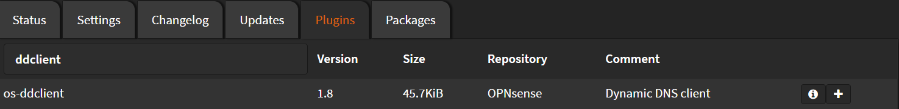

# Installation

Navigate to `System` > `Firmware` > `Plugins`

Search for `ddclient` and click <kbd>➕</kbd>



Wait until you see `**DONE**`

```shell
***GOT REQUEST TO INSTALL***
Currently running OPNsense 22.7.1 (amd64/OpenSSL) at Mon Aug 15 22:02:58 EEST 2022
Updating OPNsense repository catalogue...
OPNsense repository is up to date.
All repositories are up to date.
The following 9 package(s) will be affected (of 0 checked):

New packages to be INSTALLED:
  ddclient: 3.9.1
  os-ddclient: 1.8
  p5-Data-Validate-IP: 0.27
  p5-IO-Socket-INET6: 2.72_1
  p5-IO-Socket-SSL: 2.074
  p5-Mozilla-CA: 20211001
  p5-Net-SSLeay: 1.92
  p5-NetAddr-IP: 4.079
  p5-Socket6: 0.29

Number of packages to be installed: 9

The process will require 3 MiB more space.
742 KiB to be downloaded.
[1/9] Fetching os-ddclient-1.8.pkg: .. done
[2/9] Fetching ddclient-3.9.1.pkg: ...... done
[3/9] Fetching p5-IO-Socket-SSL-2.074.pkg: .......... done
[4/9] Fetching p5-Mozilla-CA-20211001.pkg: .......... done
[5/9] Fetching p5-Net-SSLeay-1.92.pkg: .......... done
[6/9] Fetching p5-IO-Socket-INET6-2.72_1.pkg: .. done
[7/9] Fetching p5-Socket6-0.29.pkg: ... done
[8/9] Fetching p5-Data-Validate-IP-0.27.pkg: ... done
[9/9] Fetching p5-NetAddr-IP-4.079.pkg: .......... done
Checking integrity... done (0 conflicting)
[1/9] Installing p5-Socket6-0.29...
[1/9] Extracting p5-Socket6-0.29: ....... done
[2/9] Installing p5-Mozilla-CA-20211001...
[2/9] Extracting p5-Mozilla-CA-20211001: ........ done
[3/9] Installing p5-Net-SSLeay-1.92...
[3/9] Extracting p5-Net-SSLeay-1.92: .......... done
[4/9] Installing p5-IO-Socket-INET6-2.72_1...
[4/9] Extracting p5-IO-Socket-INET6-2.72_1: ....... done
[5/9] Installing p5-NetAddr-IP-4.079...
[5/9] Extracting p5-NetAddr-IP-4.079: .......... done
[6/9] Installing p5-IO-Socket-SSL-2.074...
[6/9] Extracting p5-IO-Socket-SSL-2.074: .......... done
[7/9] Installing p5-Data-Validate-IP-0.27...
[7/9] Extracting p5-Data-Validate-IP-0.27: ....... done
[8/9] Installing ddclient-3.9.1...
[8/9] Extracting ddclient-3.9.1: ....... done
[9/9] Installing os-ddclient-1.8...
[9/9] Extracting os-ddclient-1.8: .......... done
Stopping configd...done
Starting configd.
Migrated OPNsense\DynDNS\DynDNS from 0.0.0 to 1.4.0
Reloading plugin configuration
Configuring system logging...done.
Reloading template OPNsense/Syslog: OK
Reloading template OPNsense/ddclient: OK
=====
Message from ddclient-3.9.1:

--
To configure ddclient, edit the following file:

  /usr/local/etc/ddclient.conf

If you would like to run ddclient as a daemon add the
following line to /etc/rc.conf

  ddclient_enable="YES"

If you would like to force ddclient to update your account
daily regardless of IP changes add the following line to
your /etc/periodic.conf

  daily_ddclient_force_enable="YES"
Checking integrity... done (0 conflicting)
Nothing to do.
***DONE***
```
