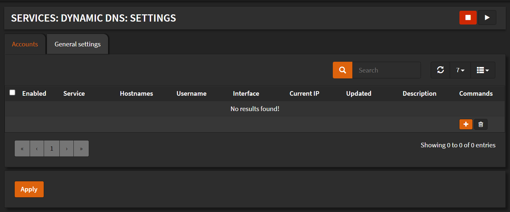
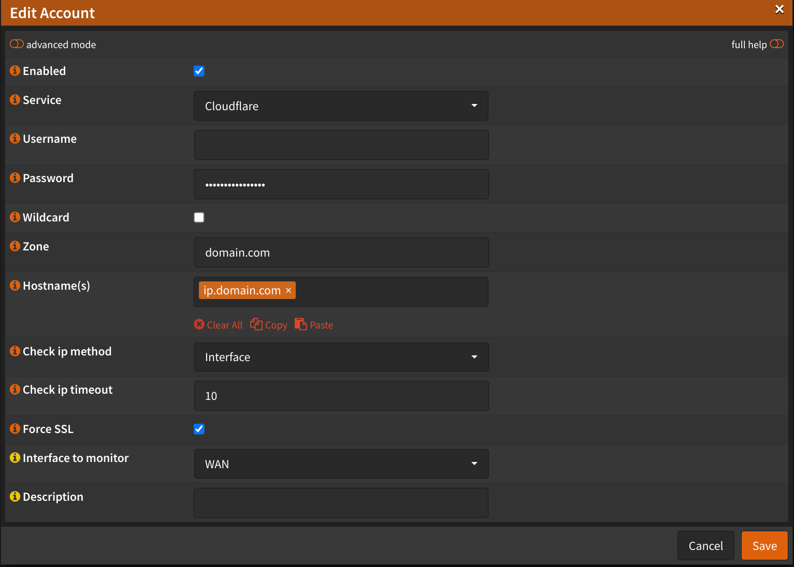
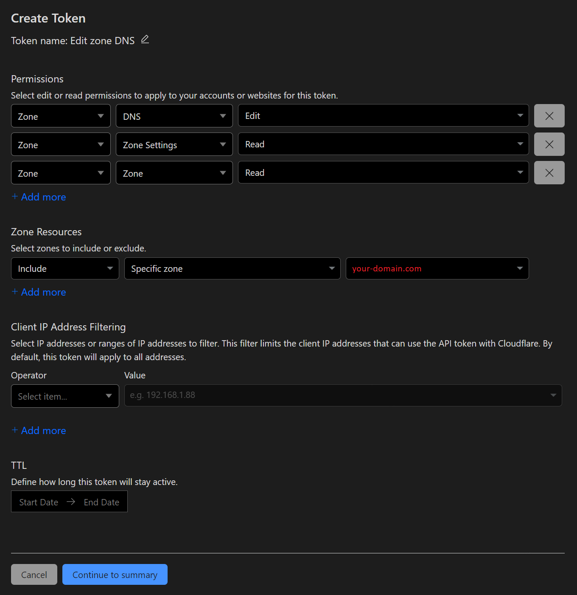

# Configuration

:::tip

Since `ddclient` version `1.11_1`, it supports API tokens.

:::

Navigate to `Services` -> `Dynamic DNS` -> `Settings`

- Click <kbd>➕</kbd>

- Check `Enabled`
- Service: `Cloudflare`
- Password: `api-token`
- Zone: `your-domain.com`
- Hostname(s): `your-domain.com`
- Check ip method: `Interface`
- Interface to monitor: `WAN`
- Description: `your-domain.com`

- Click <kbd>Save</kbd>
- Click <kbd>Apply</kbd>

## API Token

To get an `API Token`, login to your Cloudflare account.
Navigate to `My Profile` (Top right corner, on the human icon)
On the left sidebar click `API Tokens`
Click <kbd>Create Token</kbd>

From templates select `Edit zone DNS`, click on `Use template`

Under `Permissions` you should add the following:

- `Zone` -> `Zone Settings` -> `Read`
- `Zone` -> `Zone` -> `Read`
- `Zone` -> `DNS` -> `Edit`

Under `Zone Resources` you should add the following:

`Include` -> `Specific zone` -> `your-domain.com`

Click <kbd>Continue to summary</kbd>
Click <kbd>Create Token</kbd>

<kbd>Copy</kbd> the token and paste it into `Password` field in OPNSense
