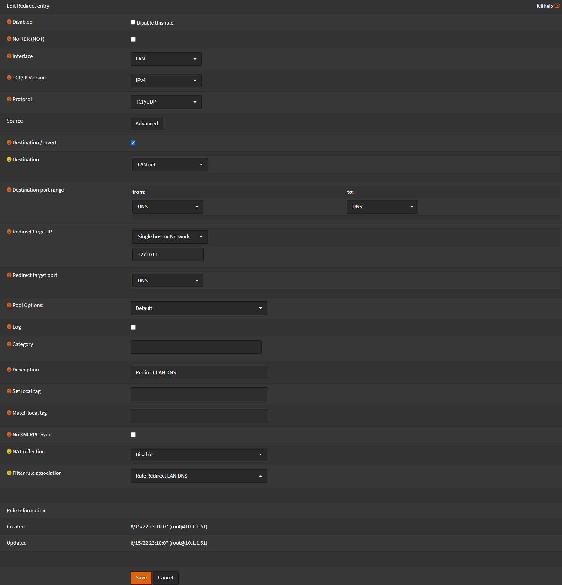
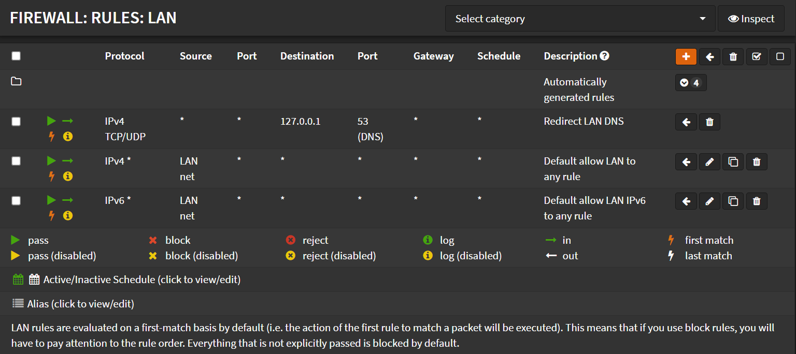
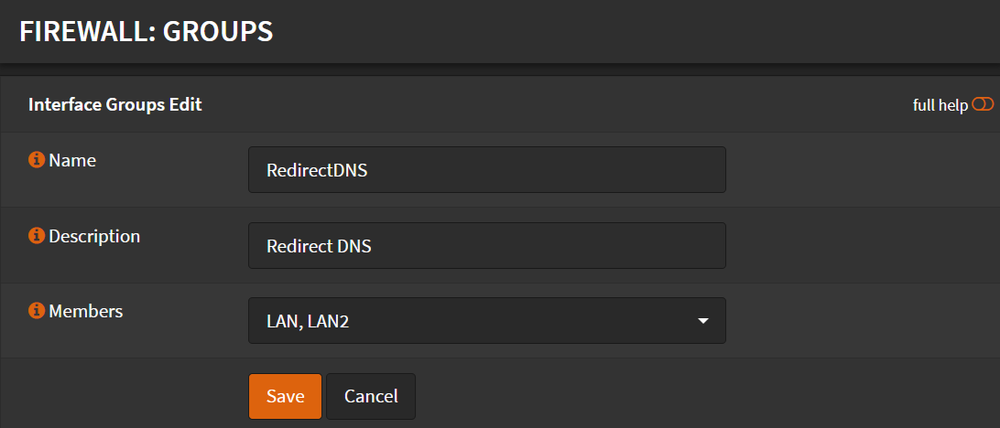
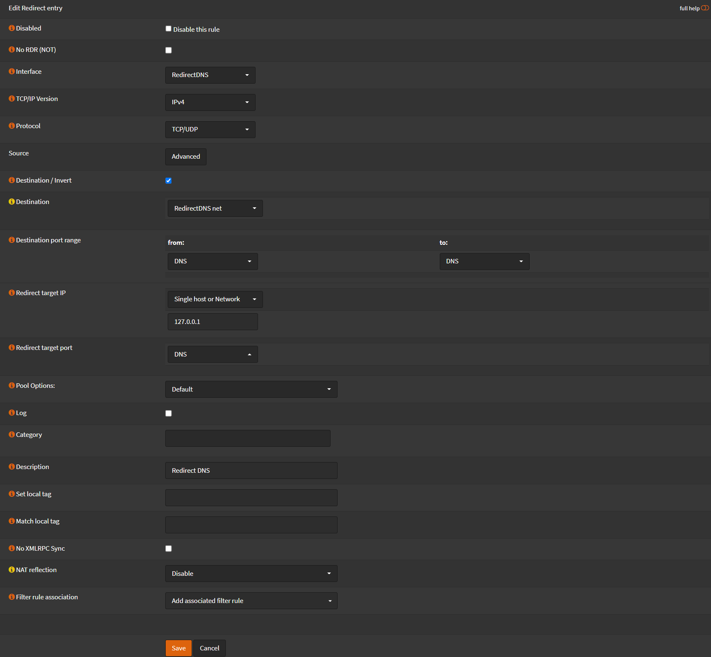

# Redirect DNS to OPNsense

You can force all clients to use OPNSense as the DNS server,
even if they manually set a different DNS on their machine.

## Single Interface

For every non-WAN interface you want to force this, do the following.
On each interface the `Interface` and `Destination`, will be different.
Or you can follow the guide bellow for `Firewall Groups`

Navigate to `Firewall` -> `NAT` -> `Port Forward`

- Click <kbd>➕</kbd>
- Interface: `LAN`
- TCP/IP Version: `IPv4`
- Protocol: `TCP/UDP`
- Check `Destination / Invert`
- Destination: `LAN net`
- Destination port rage: `DNS`
- Redirect target IP: `Single host or Network - 127.0.0.1`
- Redirect target port: `DNS`
- Description `Redirect LAN DNS`
- NAT Reflection `Disable`

- Click <kbd>Save</kbd>
- Click <kbd>Apply Changes</kbd>
- Repeat for the other Interfaces

Navigate to `Firewall` -> `Rules` -> `LAN`

- Select the `Redirect LAN DNS` rule
- Click <kbd>⬅️</kbd> on the first rule
- `Redirect LAN DNS` should be now the first rule

Repeat for all non-WAN interfaces.

- Click <kbd>Apply Changes</kbd>

## Multiple Interfaces

Navigate to `Firewall` -> `Groups`

- Name: `RedirectDNS`
- Description: `Redirect DNS`
- Members: Select the interfaces you want to force OPNSense as DNS server.

- Click <kbd>Save</kbd>
- Click <kbd>Apply Changes</kbd>

Navigate to `Firewall` -> `NAT` -> `Port Forward`

- Click <kbd>➕</kbd>
- Interface: `RedirectDNS`
- TCP/IP Version: `IPv4`
- Protocol: `TCP/UDP`
- Check `Destination / Invert`
- Destination: `RedirectDNS net`
- Destination port rage: `DNS`
- Redirect target IP: `Single host or Network - 127.0.0.1`
- Redirect target port: `DNS`
- Description `Redirect DNS`
- NAT Reflection `Disable`

- Click <kbd>Save</kbd>
- Click <kbd>Apply Changes</kbd>

Group firewall rules are higher in hierarchy than the specific interface rules.
So in this case you don't need to move any rules first.

## Notes

:::note

If clients use DNS over TLS, this will not have any effect

:::

You can block DNS queries to port `853`, but this also will not work in all scenarios.
There are many ways that a client can bypass the DNS queries.
