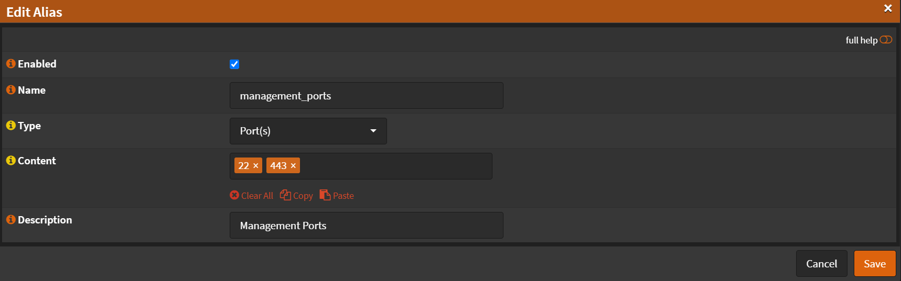

# Aliases

You can create Aliases, grouping multiple IPs, Ports, URLS, etc
making it easier to apply rules to them later.

Navigate to `Firewall` -> `Aliases`

I'll create an allias for all the management ports.
If you changed your WebUI and SSH ports, use the ones you entered!

- Click <kbd>➕</kbd>
- Name: `management_ports`
- Type: `Port(s)`
- Content: `22` `443`
- Description: `Management Ports`

- Click <kbd>Save</kbd>

Now you can use this `alias` in firewall rules.
