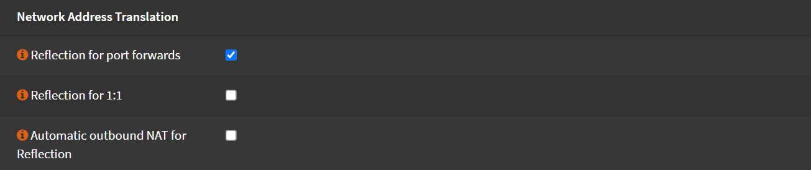

# Firewall & NAT

When you want to reach a service hosted in the same network via it's FQDN,
you have to enable NAT reflection (also known as NAT Hairpinning).

Without this, you won't be able to reach it at all,
or you can reach it but all the traffic goes out to the internet and getting back in.

Another option to solve this problem is by using Split DNS,
which is preferred, so that the firewall is not involved when using
internal resources.

## NAT Reflection

Navigate to `Firewall` -> `Settings` -> `Advanced`

- Check `Reflection for port forwards`

- Click <kbd>Save</kbd>

## Split DNS

TODO:
