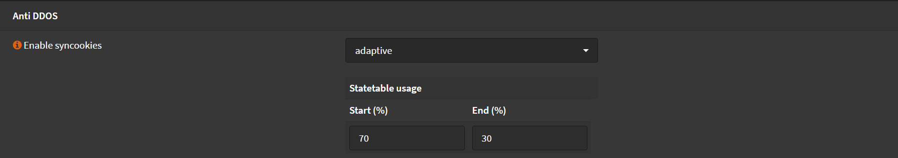

# Anti DDOS

When syncookies are active, OPNSense will answer each incoming TCP SYN with a syncookie SYNACK,
**without** allocating any resources.

In `adaptive` OPNSense will enable `syncookie` mode when a given percentage of the state table
is used up by half-open TCP connections, as in, those that saw the initial SYN but didn't finish
the three way handshake.

I prefer to set it to `adaptive`, so in normal scenarios it only uses `syncookies` where there
is an actual problem.

Navigate to `Firewall` -> `Settings` -> `Advanced`

- Enable syncookies: `adaptive`
- Start (%): `70`
- End (%): `30`
- Click <kbd>Save</kbd>

