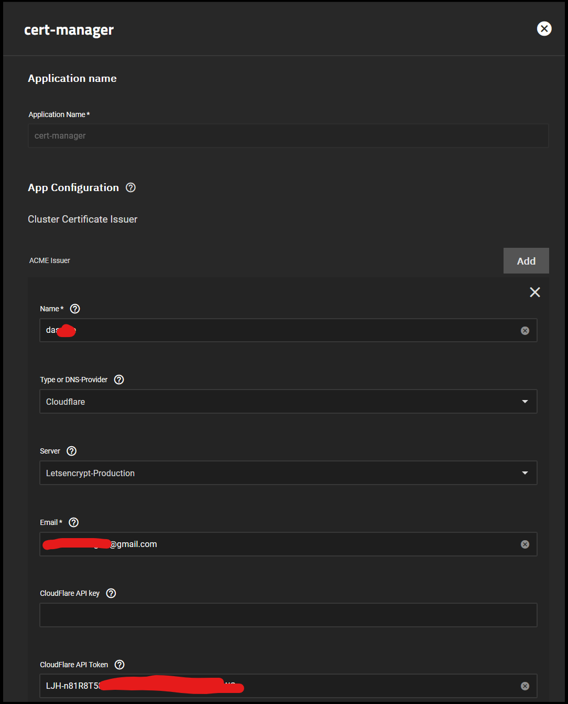
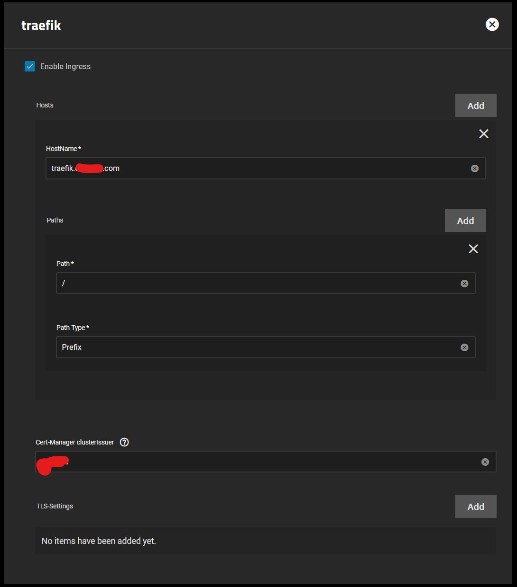

# Cert-Manager Setup Guide

Quick setup for cert-manager in case I forget.

## Prerequisites

Make sure to have the **enterprise** train enabled for `TrueCharts` as discussed [here](https://truecharts.org/manual/SCALE/guides/scale-intro).

Search for cert-manager in the `available apps` tab and click **install**.

## Cloudflare DNS

You can setup multiple domains with a single cert-manager app, all you have to do is either add the global API key (not recommended) or create multiple ACME Issuer for each domain if you created an API token.

- Give the certificate a name (eg domain or "maincert", etc).
- Select the correct provider, for example `Cloudflare`.
- Set **Server** to **Letsencrypt-Production**.
- Set Email to the account email.
- Optionally set Cloudflare API key (not recommended)
- Set the API Token to the generated one that was made in CF.

## How to Add Ingress to Apps with cert-manager

Here's a small example on how to add ingress to an app with cert-manager if its a single domain only.

:::note

If you have one domain just use `Cert-Manager clusterIssuer`. Can **NOT** be used combined with tls option below

:::

If you want to support multiple domains, use the `TLS` option to create each one, basically an extra step each time.
