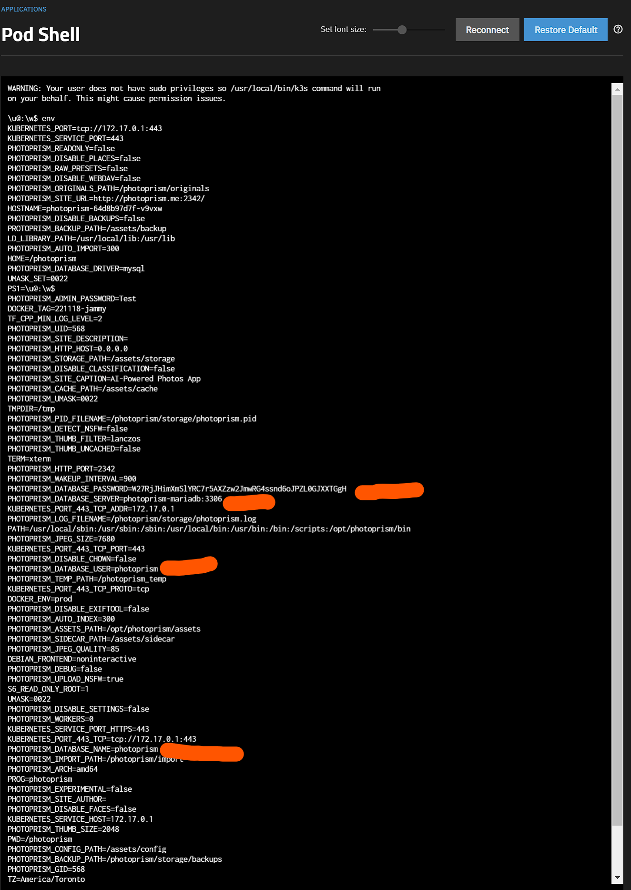
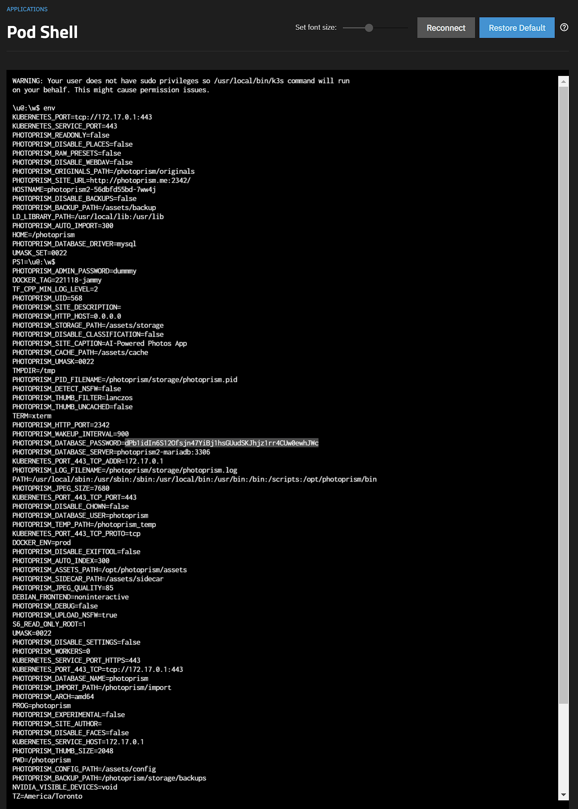
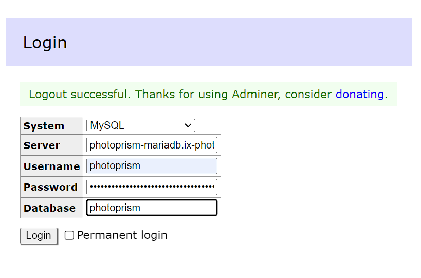
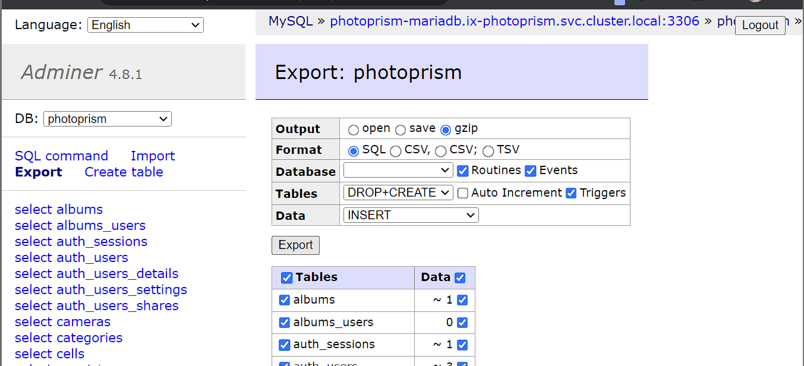
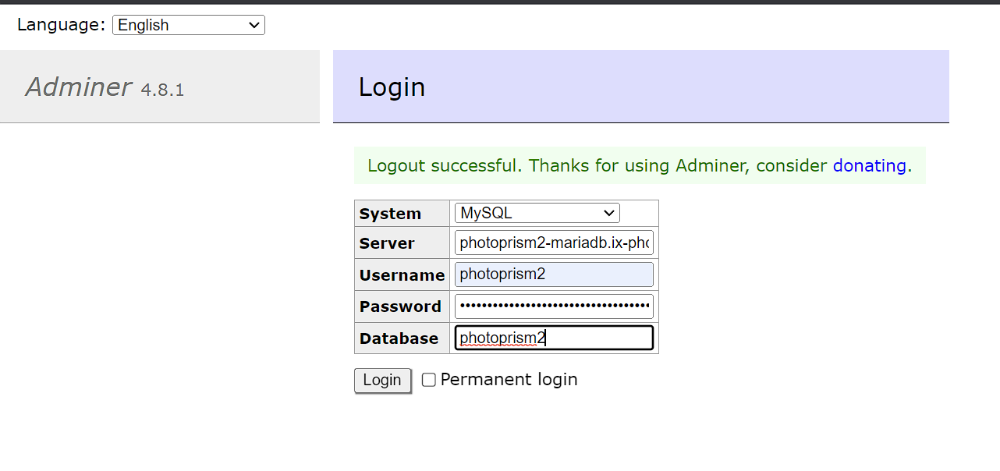
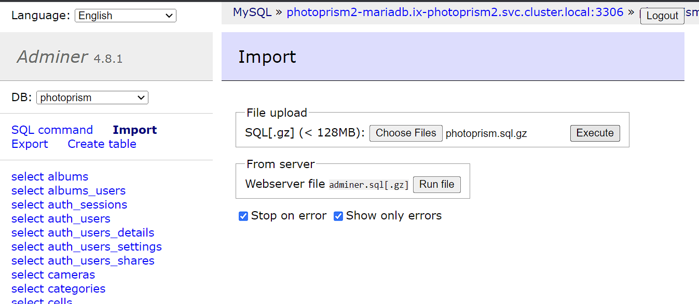

# MariaDB Specific Migration Guide

## Goal

A safe migration of an existing app to a new app, while still having the old app available. So if something goes wrong, you haven't lost the old app.

## Create new app with a different name

In this guide, I'll be using the app `photoprism` as an example. I chose the name `photoprism2` for the new app install.

I installed the new app with mostly default settings, just changed service type to `ClusterIP` and setup a new, temporary, ingress.

## Scale down both apps

We need to run the following commands in the host shell. Everything between `<>` needs to be replaced with the actual value.

First, we need to get the names of the deploys.

```bash
k3s kubectl get deploy -n ix-<old-app>
k3s kubectl get deploy -n ix-<new-app>
```

Example:

```bash
root@sauve[~]# k3s kubectl get deploy -n ix-photoprism
NAME                 READY   UP-TO-DATE   AVAILABLE   AGE
photoprism-mariadb   1/1     1            1           34m
photoprism           1/1     1            1           34m
root@sauve[~]# k3s kubectl get deploy -n ix-photoprism2
NAME                  READY   UP-TO-DATE   AVAILABLE   AGE
photoprism2-mariadb   1/1     1            1           11m
photoprism2           1/1     1            1           11m
root@sauve[~]# 
```

Here we find the names of the deploys we want to scale down. For apps installed with the default name, it will just be that name.

For apps installed with a different name, it will be `<app-name>-<default-name>`.

So for `photoprism` (the default name), it will be `photoprism`. But for the vaultwarden app that was installed with the name `photoprism`, it will be `photoprism2`.

:::caution Replace the names in the angle brackets before executing commands

```bash
k3s kubectl scale deploy <app-name>-<default-name> -n ix-<app-name> --replicas=0
k3s kubectl scale deploy <app-name> -n ix-<app-name> --replicas=0
```


:::

:::caution Example commands for apps with name photoprism and photoprism2

```bash
root@sauve[~]# k3s kubectl scale deploy photoprism -n ix-photoprism --replicas=0
deployment.apps/photoprism scaled
root@sauve[~]# k3s kubectl scale deploy photoprism2 -n ix-photoprism2 --replicas=0
deployment.apps/photoprism2 scaled
root@sauve[~]# 
```

:::

## MariaDB databases

:::info

You can skip this section if the app in question doesn't have a MariaDB database

:::

If the app uses a MariaDB database, we need to make a backup and restore that backup to the new app's database.

:::note Requirements

Make sure you have `adminer` installed, as we'll be using it to make a backup and to restore the database. It's a TrueCharts app from the stable train. You can install it with all default settings, and it will work.

:::

### Configure database connections in adminer

To get the MariaDB credentials from each install the easiest way (until a script does this) is logging into the main container shell and typing `env`, which pulls down the list of `environment variables` used by the container, including the `database credentials`.



Repeat the same for the "new" app



### Create database Backup

Login to `adminer` using the 4 values highlighted in red above. For most users it'll be `appname-mariadb.ix-appname.svc.cluster.local:3306` or in this case `photoprism-mariadb.ix-photoprism.svc.cluster.local:3306`



Click `Export`, choose a compression output (gzip) and press `export`



### Restore database backup

Now you login to `adminer` with the "new" app



Click `Import`, then `Choose Files`, upload your backup and then click `Execute`



## Migrate the PVCs

### Get the PVCs names and paths

The following commands will return the PVCs for the old and the new install.

```bash
k3s kubectl get pvc -n ix-photoprism
k3s kubectl get pvc -n ix-photoprism2
```

Take note of all the PVCs that do not contain `mariadb`. `photoprism` only has 2 data PVCs. You'll want to migrate them all.

Now, find the full paths to all these PVCs.

```bash
zfs list | grep pvc | grep legacy
```

If this returns a very long list, you can add `| grep <app-name>` to filter for only the PVCs of the app you're currently working on.

A full PVC path looks something like this: `poolname/ix-applications/releases/app-name/volumes/pvc-32341f93-0647-4bf9-aab1-e09b3ebbd2b3`.

### Destroy new PVC and copy over old PVC

Destroy the PVCs of the new app and replicate the PVC of the old app to the new location.

:::danger

Make sure you're not mixing up the old app and the new app here. Destroy the *NEW* PVC. The old PVC contains your data.

:::

```bash
zfs destroy new-pvc
zfs snapshot old-pvc@migrate
zfs send old-pvc@migrate | zfs recv new-pvc@migrate
zfs set mountpoint=legacy new-pvc
```

The `new-pvc` will look something like `poolname/ix-applications/releases/photoprism/volumes/pvc-32341f93-0647-4bf9-aab1-e09b3ebbd2b3`.

The `old-pvc` will look something like `poolname/ix-applications/releases/photoprism2/volumes/pvc-40275e0e-5f99-4052-96f1-63e26be01236`.

Example of all commands in one go:

```bash
root@sauve[~]# k3s kubectl get pvc -n ix-photoprism               
NAME                        STATUS   VOLUME                                     CAPACITY   ACCESS MODES   STORAGECLASS                  AGE
photoprism-photoprismtemp   Bound    pvc-69edca6c-1510-47d0-ae10-8d715a7ba623   256Gi      RWO            ix-storage-class-photoprism   69m
photoprism-mariadb-data     Bound    pvc-10a72fdb-6d91-4f72-a9e5-e68d164a76f1   1Gi        RWO            ix-storage-class-photoprism   69m
photoprism-storage          Bound    pvc-a4278938-c357-4a3a-bb92-f8c023b39065   256Gi      RWO            ix-storage-class-photoprism   69m
root@sauve[~]# k3s kubectl get pvc -n ix-photoprism2
NAME                         STATUS   VOLUME                                     CAPACITY   ACCESS MODES   STORAGECLASS                   AGE
photoprism2-photoprismtemp   Bound    pvc-5bd6751a-6d7a-400e-9140-0282e638479a   256Gi      RWO            ix-storage-class-photoprism2   48m
photoprism2-storage          Bound    pvc-6de798ee-fca6-49bc-82d1-59f4eaa6bd93   256Gi      RWO            ix-storage-class-photoprism2   48m
photoprism2-mariadb-data     Bound    pvc-907b4c68-8c6d-4005-9d1a-62dec7e31c7f   1Gi        RWO            ix-storage-class-photoprism2   48m
root@sauve[~]# zfs list | grep pvc | grep legacy | grep photoprism
nvme-apps/ix-applications/releases/photoprism/volumes/pvc-10a72fdb-6d91-4f72-a9e5-e68d164a76f1                      2.90M  1021M     2.90M  legacy
nvme-apps/ix-applications/releases/photoprism/volumes/pvc-69edca6c-1510-47d0-ae10-8d715a7ba623                        96K   256G       96K  legacy
nvme-apps/ix-applications/releases/photoprism/volumes/pvc-a4278938-c357-4a3a-bb92-f8c023b39065                      1.40M   256G     1.40M  legacy
nvme-apps/ix-applications/releases/photoprism2/volumes/pvc-5bd6751a-6d7a-400e-9140-0282e638479a                       96K   256G       96K  legacy
nvme-apps/ix-applications/releases/photoprism2/volumes/pvc-6de798ee-fca6-49bc-82d1-59f4eaa6bd93                      120K   256G      120K  legacy
nvme-apps/ix-applications/releases/photoprism2/volumes/pvc-907b4c68-8c6d-4005-9d1a-62dec7e31c7f                     3.17M  1021M     3.17M  legacy
root@sauve[~]# zfs destroy nvme-apps/ix-applications/releases/photoprism2/volumes/pvc-5bd6751a-6d7a-400e-9140-0282e638479a
root@sauve[~]# zfs snapshot nvme-apps/ix-applications/releases/photoprism/volumes/pvc-69edca6c-1510-47d0-ae10-8d715a7ba623@migrate
root@sauve[~]# zfs send nvme-apps/ix-applications/releases/photoprism/volumes/pvc-69edca6c-1510-47d0-ae10-8d715a7ba623@migrate | zfs recv nvme-apps/ix-applications/releases/photoprism2/volumes/pvc-5bd6751a-6d7a-400e-9140-0282e638479a@migrate
root@sauve[~]# zfs set mountpoint=legacy nvme-apps/ix-applications/releases/photoprism2/volumes/pvc-5bd6751a-6d7a-400e-9140-0282e638479a
root@sauve[~]# zfs destroy nvme-apps/ix-applications/releases/photoprism2/volumes/pvc-6de798ee-fca6-49bc-82d1-59f4eaa6bd93
root@sauve[~]# zfs snapshot nvme-apps/ix-applications/releases/photoprism/volumes/pvc-a4278938-c357-4a3a-bb92-f8c023b39065@migrate
root@sauve[~]# zfs send nvme-apps/ix-applications/releases/photoprism/volumes/pvc-a4278938-c357-4a3a-bb92-f8c023b39065@migrate | zfs recv nvme-apps/ix-applications/releases/photoprism2/volumes/pvc-6de798ee-fca6-49bc-82d1-59f4eaa6bd93@migrate
root@sauve[~]# zfs set mountpoint=legacy nvme-apps/ix-applications/releases/photoprism2/volumes/pvc-6de798ee-fca6-49bc-82d1-59f4eaa6bd93
```

## Scale up both apps

Use the same commands from the scaling down step, but replace the 0 with a 1.

```bash
k3s kubectl scale deploy photoprism -n ix-photoprism --replicas=1
k3s kubectl scale deploy photoprism2 -n ix-photoprism2 --replicas=1
```

## Conclusion

You should now be able to log in on the new install.
