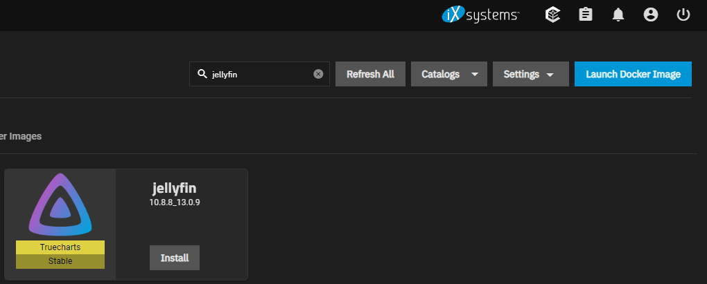
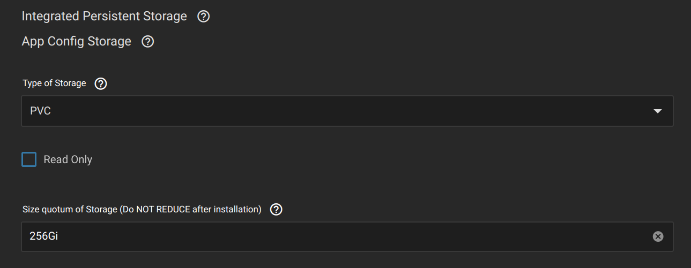
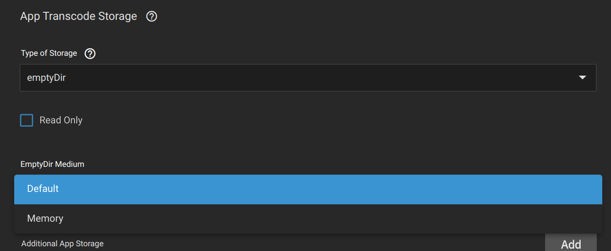
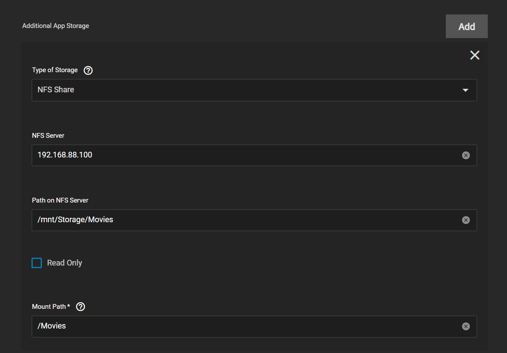
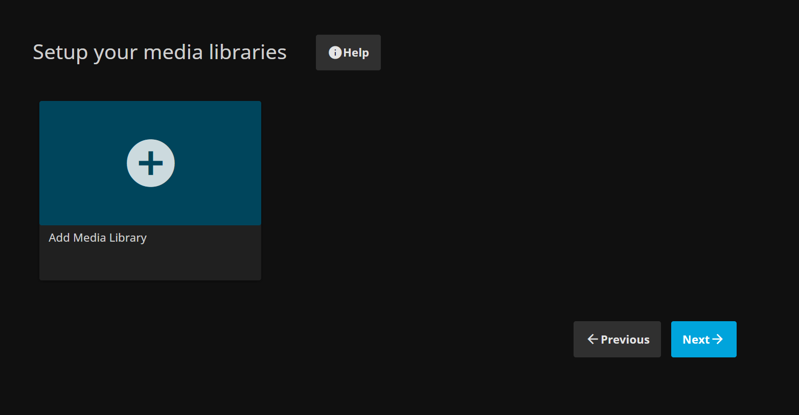
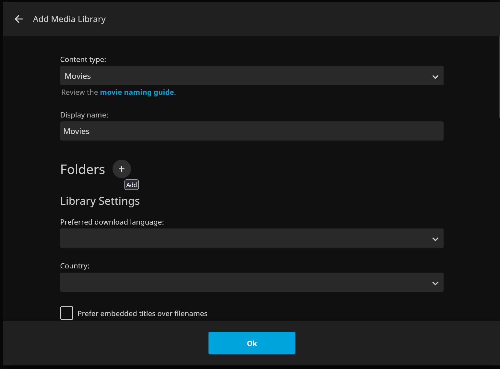
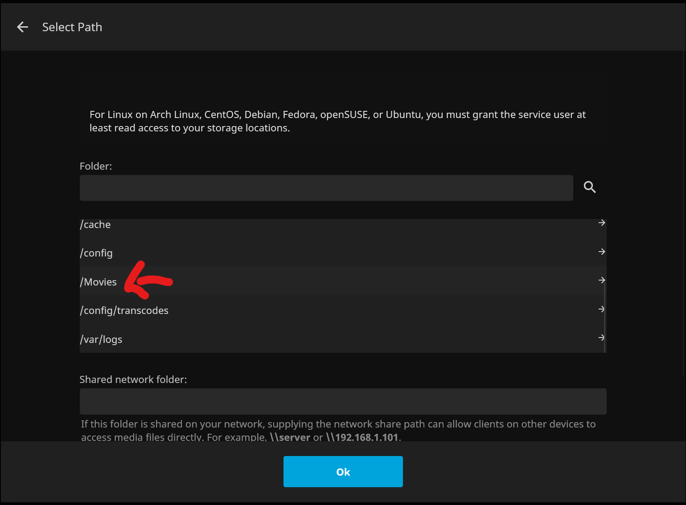
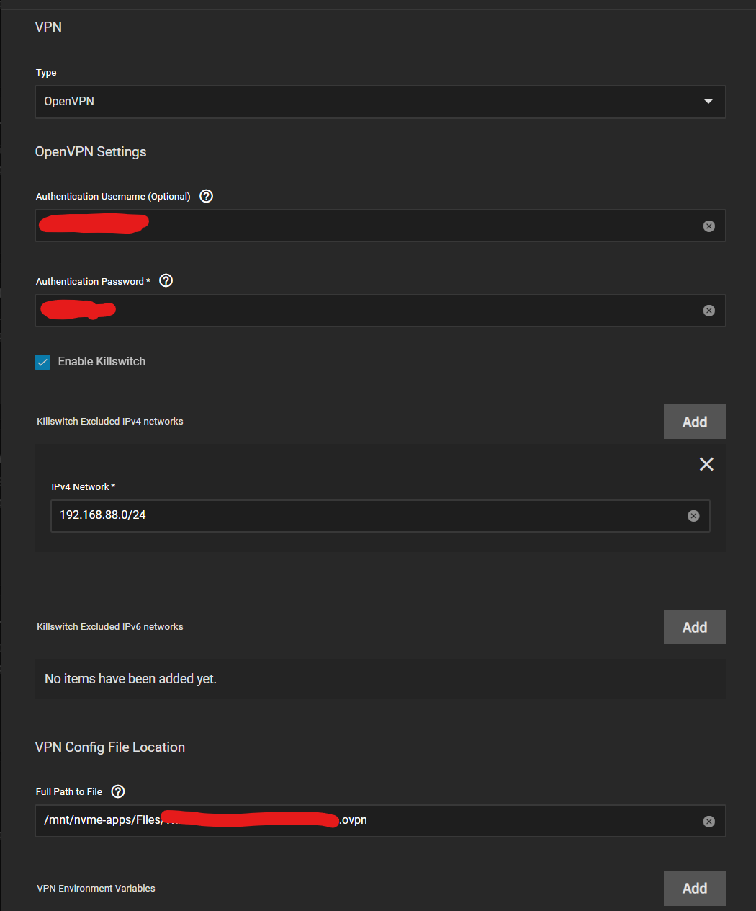
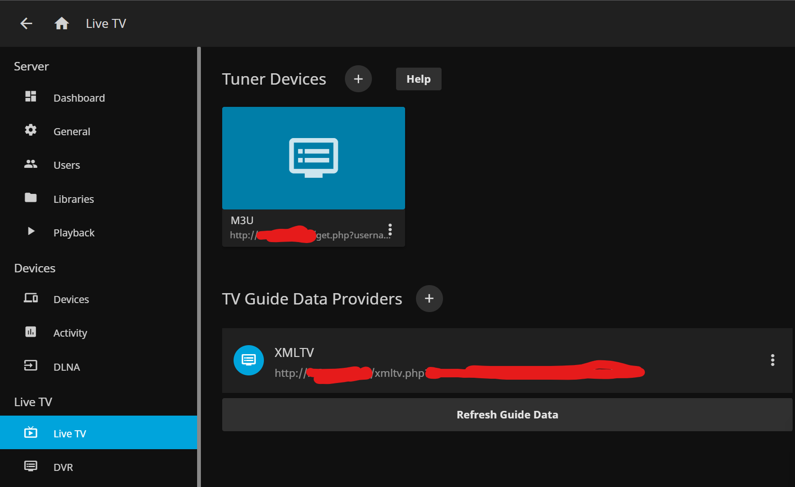

# Jellyfin and IPTV VPN setup info

**Jellyfin** Media Server is a free fully open-source solution to watch your media from anywhere
and our app is a simple way to install it on your TrueNAS SCALE server. I wrote this for [TrueCharts](https://truecharts.org) so might as well load it here. The bonus stuff is for me to remember my IPTV setup and bonus.

## Requirements

- Jellyfin TrueCharts Chart
- Installation of the TrueCharts Catalog, starting [here](https://truecharts.org/manual/guides/Adding-TrueCharts)

## Media Storage

- We recommend having configured your media before installing the chart.
  Most people will have their media inside their TrueNAS box,
  and for that you can simply follow our [Adding Storage](https://truecharts.org/manual/guides/add-storage/#adding-additional-app-storage)
  guide to `Add Additional App Storage` to **Jellyfin** for their media folder.
- However some will prefer `NFS Shares` for this storage,
  as they may need to share these folders with other users on other
  devices outside of TrueNAS, so we recommend following the [using NFS Shares guide](https://truecharts.org/manual/guides/nfs-share).

## Install Jellyfin inside TrueNAS SCALE

- Select `Apps` inside the `TrueNAS` menu,
- Then choose the `Available Applications` tab,
- and search for `jellyfin`

- Click the Install button, and you’ll be prompted to set up the **Jellyfin** software.
- Most of the settings can be left at the default values, but ensure you select the correct
  timezone before scrolling down to the Networking and Services section.
  Take note of the default port (8096) that **Jellyfin** is listening on, and move down to Storage and Persistence.

### Jellyfin Configuration Storage

The Jellyfin software itself will have some integrated configuration storage included
with a “PVC” storage type - make sure not to change this, as it’s the preferred and supported option from TrueCharts.

### Jellyfin App Transcode Storage

Users can choose from the default PVC for the **Jellyfin** App Transcode directory or they can
change the App Transcode Storage to the emptyDir type, with the Default storage medium.

More advanced users with a large amount of RAM in their TrueNAS machine might consider
changing the transcoding space to use the Memory storage medium. Note that this can potentially
consume a large amount of memory if you’re streaming high-definition video content, or multiple streams at the same time.

### Jellyfin Media Storage

To add your media directory inside **Jellyfin** you have to click on `Add` in the `Additional App Storage` section.

Depending on your media type (HostPath or NFS) feel free to follow the guides linked earlier in this guide.
As an example we'll add an existing `NFS Share` as many users will have that for their media storage.

- Select an NFS Share for the type of storage
- Enter `localhost` or the `IP address` for your NFS server.
- Enter the path to your media folder, making sure to match the capitalization,
- Fill out and take note of a Mount Path that your **Jellyfin** server will access it through. Mark this as Read Only.

Repeat this process for each additional media folder you may have.

If you have a GPU in your TrueNAS system that’s capable of video transcoding in hardware,
you can add it to **Jellyfin** under the Resources and Devices section.

Scroll to the bottom of the window and click Save.

Once you hit Save, the process of downloading and setting up **Jellyfin** will begin.
Switch back to the Installed Applications tab, and wait for the application to switch
from Deploying to Active - once it does, click the Open button to launch the **Jellyfin** welcome portal.

## Jellyfin Initial Setup

Select your language, define a user to be used for administrative purposes in **Jellyfin**
(as well as your first playback) and then choose the Add Media Library button.

Choose the media type (or as best as you can match it) and click the (+) sign beside Folders to add a Mount Path that you shared over NFS from above.

- If required, add more media libraries - music, TV shows, photos - and then click Next.
- Set your default metadata language for obtaining media information from the Internet,
  and leave the Allow remote connections to this server option checked - otherwise,
  you won’t be able to view anything you just made available.
- Click on Finish and you’ll be sent to the dashboard, where you can log in as the user you set up during the wizard, and start watching your shows!

## IPTV Setup

If using this for IPTV, it's HIGHLY recommend you use a VPN, since some providers get blocked at random times in the day like mine for no reason at all.

First get your IPTV credentials. Both the M3U and the XMLTV file for the guide.

  
IPTV Provider Example inside

  

    
This is my provider, don't ask about how to get it, go on Reddit or something

MFG TV Xtream Codes Login
Preferred method instead of M3U for apps like Tivimate, GSE IPTV, IPTV Smarters, MYTVOnline & More.

Choose Xtream Codes Login and enter portal URL http://mfgtv.me:83 then enter your username & password EXCATLY as shown in your details email. They are Case Sensitive.

MFG TV M3U URL – http://mfgtv.me:83/get.php?username=USERNAME&password=PASSWORD&type=m3u&output=ts
MFG TV EPG URL – http://mfgtv.me:83/xmltv.php?username=USERNAME&password=PASSWORD
LinkTree: https://linktr.ee/savagestreams– On Android Settings, Security, Allow LinkTree to Install Apps.
  

Then you add the VPN to your Jellyfin install. I'm using OVPN since I think there's a limit on Wireguard keys so OVPN is fine for me for this. You need a .conf or .OVPN file from your provider and the credentials if using OpenVPN

Once that's good you enable the Live TV provider (an IPTV M3U stream in my case) inside `Administration` -> `Dashboard`

### Live TV Setup

Once you have the VPN added and your credentials, all you need to do is setup the 2 items below and you're good

