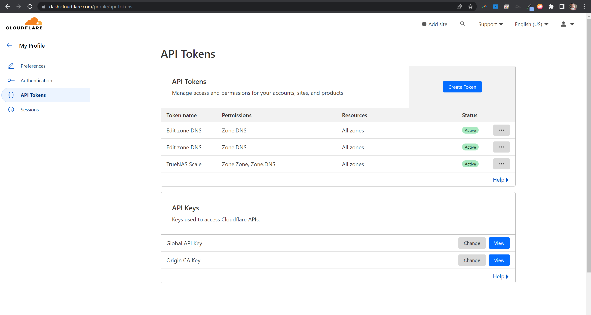
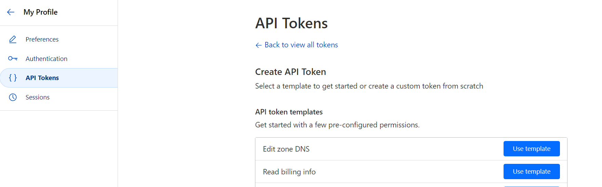
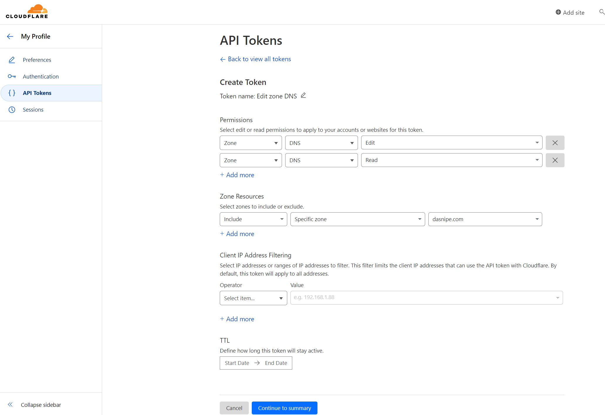
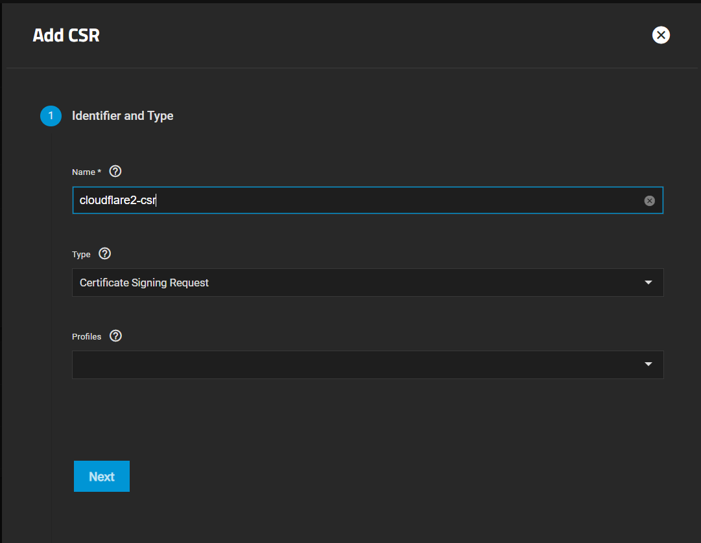
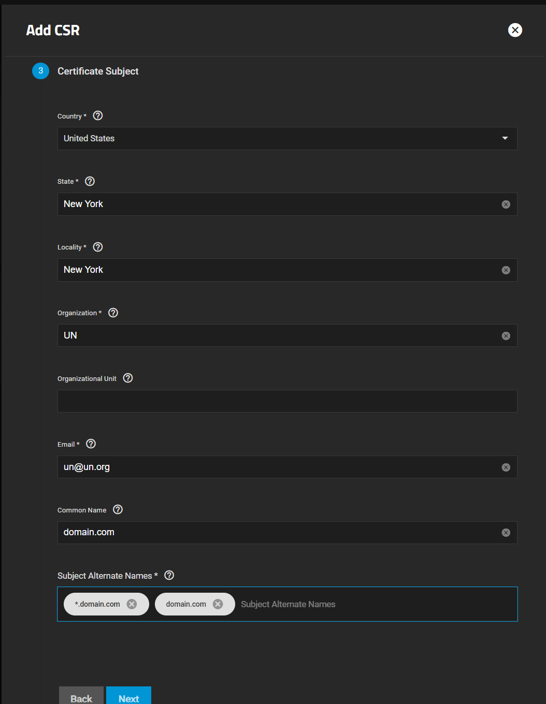
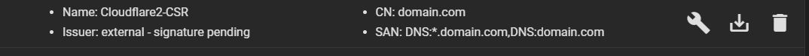
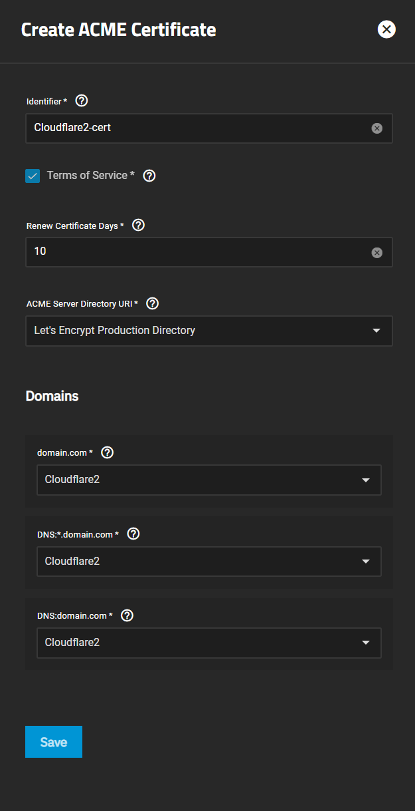
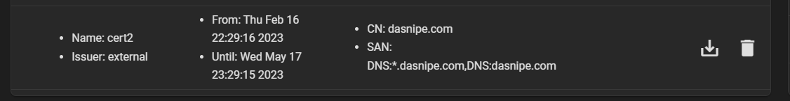
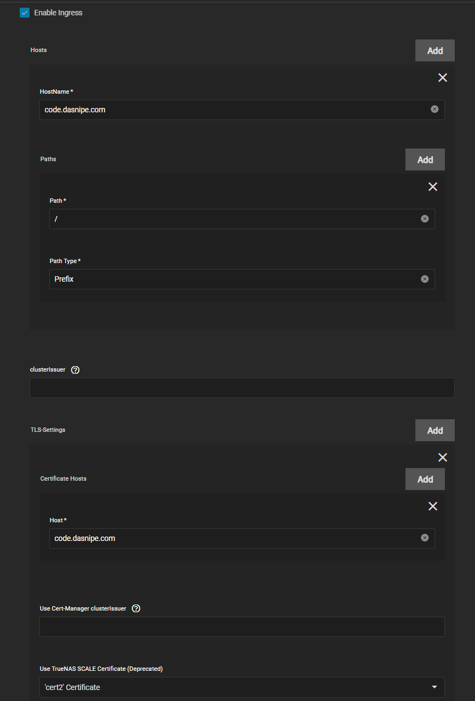

# TrueNASAdding LetsEncrypt Certificates

A guide to adding lets encrypt certificates to TrueNAS SCALE through the Certificates menu in the GUI, inspired by xstar and the TrueCharts guide. This method will be supported by TrueCharts for a while so might as well create a writeup for it

## Prerequisites:

- Own a domain from either Cloudflare or using Cloudflare for DNS (can use Route53 if neccessary)
  - If the domain is provided from another registrar, you can freely change the nameservers of your domain to CF and have it manage your domain.
- I'm using Cloudflare for this guide
- Root/Admin user for scale should have an email setup prior to this task.
  - Edit the user in credentials -> local users and add an email for the `root` user since it doesn't have one by default.

## Cloudflare

Go to your Domain inside Cloudflare and then click on the [Get Your API Token](https://dash.cloudflare.com/profile/api-tokens) link in the bottom right. Then click `Create Token` (see below).

Select the `Edit Zone DNS` button to use that template and create one for each root domain you want to add to scale's ACME section.

Under Create token, edit the name for this token and give it a good name for example `SCALE-domain-token`.

The default Permissions only include `Edit` so make to create one for `Read` as below

`Continue to summary` and then create token.

## TrueNAS SCALE

Click on the `Credentials` -> `Certificates` page in TrueNAS SCALE GUI.

### ACME DNS Authenticators

First step is to click on the `Add` button in the `ACME DNS-Authenticators` or bottom right so we can add the domain token to TrueNAS SCALE.

I already have another "Cloudflare" named DNS authenticator so you can name it as you wish.

### Certificate Signing Requests

Next we create a `Certificate Signing Request` or CSR to sign the servicates we ask SCALE to create. This is on the top right corner. Click `Add` and give it a name.

- Step 1 - Give it a name, I like adding -csr to the certificate name

- Step 2 -> Leave Defaults

- Step 3
  - Fill in details as necessary, but pay attention to the last section
  - Common Name should be the the root domain. (aka `domain.com`)
  - Subject Alternate Name should contain both the root domain (`domain.com`) and the wildcard for subdomains (`*.domain.com`) unless you're doing multiple certificates.

- Step 4 -> Leave Defaults

- Step 5 -> Confirm and save

Afterwards you'll see an `External - Signature Pending` if done correctky.

### Creating a Certificate

TNow to populate the `Certificates` section you have to create the cert click the `Wrench` icon on the CSR you just made.

Give it a name like `domain-cert` or something and `Click` the Terms of Service.

Set the ACME **Server Directory URI\*** to `Let's Encrypt Production Directory`.

Last you select the ACME DNS Authenticator Name (see above) that you created in the first step for this domain.

Click save and you'll have a brand new `certificate` for use with TrueNAS SCALE.

## Integrating TrueNAS SCALE certificates with Traefik Ingress

- Following the [TrueCharts Traefik How-To](https://truecharts.org/charts/enterprise/traefik/how-to) is the best option since it should have the latest info.
- Once Traefik is installed and ready (GUI ports moved and Traefik on 80/443) then click on `Enable Ingress` and add the certificate as below

